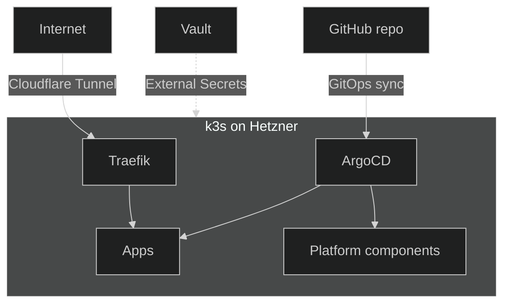
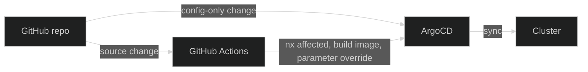

## What is Nexus?

Nexus is my personal developer platform — a space to design and validate
platform-engineering ideas while running real applications in a
production-like environment.

Instead of re-bootstrapping CI/CD, secrets, networking, and observability
for every side project, Nexus provides them once and lets every new project
plug in. It is also a learning environment: every component is chosen
because I want to understand it deeply, not just use it. If something feels
like a black box, it does not belong here.

## Architecture

The platform runs on a [k3s](https://k3s.io/){ target="\_blank" rel="noopener" }
cluster on
[Hetzner Cloud](https://www.hetzner.com/cloud){ target="\_blank" rel="noopener" }.
Everything is declarative — infrastructure is provisioned with
[Terraform](https://developer.hashicorp.com/terraform){ target="\_blank" rel="noopener" },
and the cluster continuously reconciles to whatever is in Git via
[ArgoCD](https://argo-cd.readthedocs.io/){ target="\_blank" rel="noopener" }.

A few decisions worth calling out:

- **k3s on Hetzner** — single-binary Kubernetes on commodity VMs. Real K8s
  primitives without the cost or operational overhead of a managed control
  plane. Hetzner is also dramatically cheaper than the hyperscalers for
  what Nexus needs, which keeps the project sustainable as a side
  investment rather than a recurring expense.
- **ArgoCD over scripted deploys** — the cluster state is a function of
  Git. Drift is impossible, rollback is one revert, and onboarding a new
  component is a YAML file. Hotfixes are also painless: a parameter can be
  tweaked from the ArgoCD UI to unblock production immediately, and as
  long as the change is mirrored back to Git, there is no risk of drift —
  the next sync confirms the desired state.
- **[Cloudflare Tunnel](https://developers.cloudflare.com/cloudflare-one/connections/connect-networks/){ target="\_blank" rel="noopener" }
  instead of a load balancer** — no public IP, no exposed ports. The
  cluster dials out to Cloudflare; Cloudflare brings the traffic in. Free,
  and a dramatic reduction in attack surface. A real load balancer is
  mostly useful for redundancy, and Nexus does not serve the kind of
  traffic that justifies one yet.
- **[Vault](https://developer.hashicorp.com/vault){ target="\_blank" rel="noopener" } +
  [External Secrets Operator](https://external-secrets.io/){ target="\_blank" rel="noopener" }**
  — secrets stay out of Git, but the cluster manifests can still be
  entirely declarative. Secret references in Git, secret values in Vault.
- **[Traefik](https://doc.traefik.io/traefik/){ target="\_blank" rel="noopener" }
  as ingress** — terminates TLS and routes traffic from the Cloudflare
  Tunnel to the right service inside the cluster.

## Delivery model

Nexus is biased toward **GitOps wherever possible**. The cluster reconciles
itself from Git, and the path a change takes depends on whether it touches
config or source code.

**Case 1 — off-the-shelf tools, configured through Git.** Most of the
platform is third-party tools we just configure: Traefik, ArgoCD itself,
External Secrets, the monitoring stack, ARC runners, and so on. A change
here is a config change — a tweaked Helm value, a new ConfigMap, an
updated secret reference — committed to Git. ArgoCD picks it up and
syncs. **No GitHub Actions involved.**

**Case 2 — custom or extended tools that ship a container image.** The
portfolio, the docs site, and the
[CI toolkit image](https://github.com/kbntx/nexus/tree/main/platform/services/custom-docker-images){ target="\_blank" rel="noopener" }
are ours. When their source changes, CI takes over: it uses
[Nx](https://nx.dev/){ target="\_blank" rel="noopener" } to figure out what
actually moved (`nx affected` against the base branch), rebuilds only the
impacted images, and then points ArgoCD at the new commit through a
parameter override before triggering a sync. The full flow lives in
[`.github/workflows/`](https://github.com/kbntx/nexus/tree/main/.github/workflows){ target="\_blank" rel="noopener" }.

The long-term direction is to push everything into ArgoCD and let GitHub
Actions do **continuous integration only** — testing, linting, building
images. Image rollouts would then come from an in-cluster image-update
controller watching the registry, removing the last imperative step from
the deploy pipeline.

The pipelines themselves run on **self-hosted ARC runners inside the
cluster**, so even CI is part of the GitOps-managed workload.

---

To get started using Nexus, head over to
[Local development](02-local-development.md).

## References

- [`platform/services/app-of-apps/`](https://github.com/kbntx/nexus/tree/main/platform/services/app-of-apps){ target="\_blank" rel="noopener" } — every cluster-side workload, declared as an ArgoCD application
- [`platform/`](https://github.com/kbntx/nexus/tree/main/platform){ target="\_blank" rel="noopener" } — infrastructure, GitOps, ingress, secrets, observability
- [`.github/workflows/`](https://github.com/kbntx/nexus/tree/main/.github/workflows){ target="\_blank" rel="noopener" } — image builds, the `nx affected` gating, and the imperative Terraform pipelines
