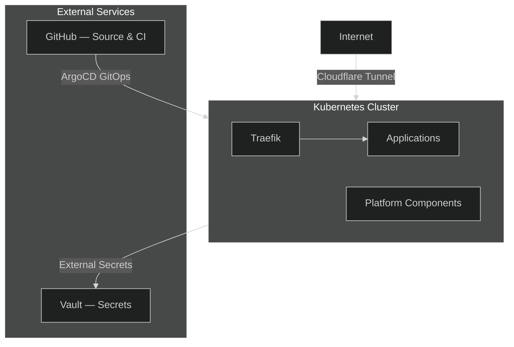

## What is Nexus?

Nexus is my personal developer platform — a space to experiment with cloud-native infrastructure patterns and build a solid, reusable foundation for all my side projects.

The idea is simple: instead of reinventing the wheel for each new project (CI/CD setup, secrets management, observability, deployment pipeline), Nexus provides all of that out of the box. A new project just needs to plug in.

It is also a learning environment. Every component is chosen because I want to understand it deeply, not just use it. The platform deliberately covers the full stack: infrastructure provisioning, GitOps, networking, secrets, observability, and application delivery.

## How the Documentation is Organised

- **Getting Started** (this section) — what Nexus is, how the platform is architected, and how to run it locally
- **Platform** — one section per component, covering why it was chosen, how it is configured, and the patterns around it

## Architecture

The platform runs on a **Kubernetes cluster** (K3S) hosted on **Hetzner Cloud**. Everything is declarative: infrastructure is provisioned with Terraform, workloads are deployed via ArgoCD watching this Git repository.

**Key components:**

| Area           | What                                                            |
| -------------- | --------------------------------------------------------------- |
| Infrastructure | K3S on Hetzner Cloud, provisioned with Terraform                |
| GitOps         | ArgoCD — the cluster always converges to what's in Git          |
| Networking     | Cloudflare Tunnel + Traefik — no public load balancer           |
| Secrets        | HashiCorp Vault + External Secrets Operator — no secrets in Git |
| Observability  | Grafana, Loki, VictoriaMetrics                                  |
| CI/CD          | GitHub Actions with self-hosted runners inside the cluster      |
| Applications   | Portfolio, Documentation, Homepage                              |
