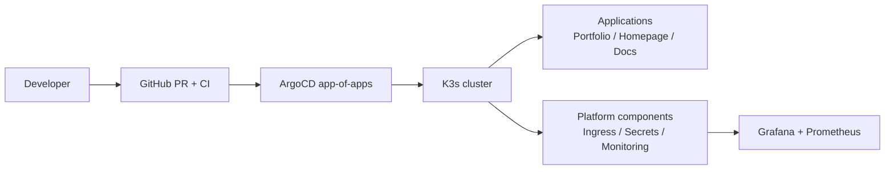

# Nexus documentation

This documentation is the practical guide to working in the Nexus repository.

It is intentionally opinionated and focused on **how we use tools in this repo**, not a copy of official documentation.

## Start here

- New to the repo? Read [Onboarding](onboarding/index.md).
- Need architecture context? Read [Platform overview](platform/index.md).
- Looking for day-2 commands? Go to [Runbooks](runbooks/common-tasks.md).

## What Nexus contains

