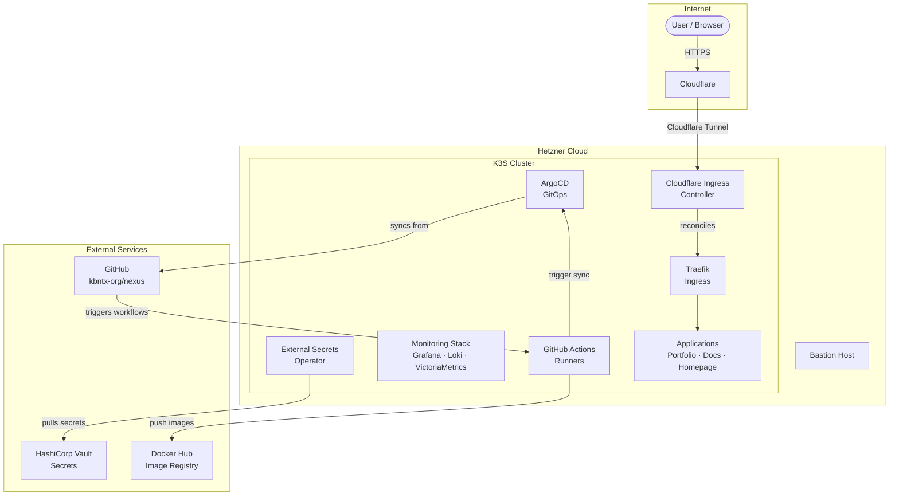

# Nexus Platform

Nexus is a personal **platform engineering hub** — a production-grade monorepo that covers the full lifecycle of a cloud-native platform: infrastructure provisioning, GitOps deployment, secrets management, observability, networking, CI/CD, and application delivery.

It started as a homelab project and grew into a showcase of how platform engineering principles can be applied end-to-end, from a bare Hetzner VPS to running workloads accessible at public URLs.

## Architecture at a glance

## What's inside

| Area | Components |
|------|-----------|
| **Infrastructure** | K3S on Hetzner Cloud, Terraform modules, VPC, Bastion |
| **GitOps** | ArgoCD, App-of-Apps pattern |
| **Networking** | Traefik, Cloudflared, custom Cloudflare Ingress Controller |
| **Security** | HashiCorp Vault, External Secrets Operator |
| **Observability** | Grafana, Loki, Promtail, VictoriaMetrics, Node Exporter |
| **CI/CD** | GitHub Actions, self-hosted ARC runners, custom CI toolkit |
| **Applications** | Portfolio (Angular), Documentation (MkDocs), Homepage |

## Where to start

New to the platform? Head to **[Onboarding →](onboarding/index.md)** for prerequisites and a guided tour.

Familiar with the basics? Jump into the **[Platform →](platform/index.md)** section to explore individual components.
