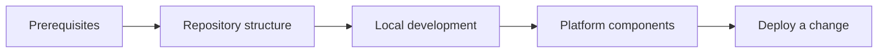
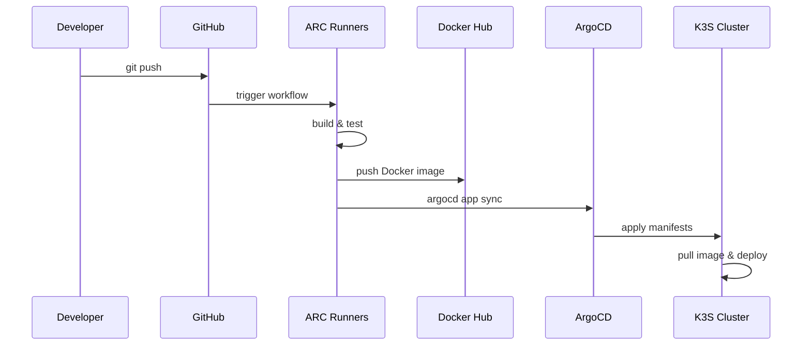

# Onboarding

This section gets you oriented in the Nexus platform — what it is, how it's laid out, and what you need to start contributing or running it yourself.

## Learning path



## Repository layout

```
nexus/
├── apps/                    # Deployable applications
│   ├── portfolio/           # Angular portfolio site
│   └── homepage/            # Homepage app
├── platform/                # Infrastructure & platform components
│   ├── app-of-apps/         # ArgoCD app-of-apps (the root of all deploys)
│   ├── argocd/              # ArgoCD Helm chart
│   ├── cloudflare-ingress-controller/  # Custom TypeScript controller
│   ├── cloudflared/         # Cloudflare tunnel daemon
│   ├── external-secrets/    # External Secrets Operator
│   ├── github-arc-runners/  # Self-hosted GitHub Actions runners
│   ├── hetzner-cloud-controller/
│   ├── k3s-upgrades/        # Cluster upgrade plans
│   ├── kubernetes/          # Terraform: K3S cluster
│   ├── monitoring/          # Grafana · Loki · VictoriaMetrics stack
│   ├── network/             # Terraform: VPC & network
│   ├── terraform-modules/   # Reusable Terraform modules
│   ├── traefik/             # Traefik ingress controller
│   └── vault/               # HashiCorp Vault
├── docs/                    # This documentation site
│   ├── src/                 # Markdown content
│   ├── mkdocs.yml           # MkDocs configuration
│   └── helm/                # Kubernetes deployment chart for docs
└── .github/
    ├── actions/             # Reusable composite actions
    └── workflows/           # CI/CD pipelines
```

## How the platform works

Everything runs on a **K3S** Kubernetes cluster hosted on **Hetzner Cloud**. The cluster is provisioned with **Terraform**, and all workloads are deployed via **ArgoCD** in a GitOps model — meaning the cluster state is always driven by what's in this repository.



## Prerequisites

Before working with Nexus, you'll need:

| Tool            | Purpose                      | Version          |
| --------------- | ---------------------------- | ---------------- |
| `terraform`     | Provision infrastructure     | ≥ 1.0            |
| `kubectl`       | Interact with the cluster    | ≥ 1.29           |
| `helm`          | Render / inspect Helm charts | ≥ 3.14           |
| `argocd`        | Interact with ArgoCD         | ≥ 2.14           |
| `node` + `pnpm` | Frontend development         | Node 22, pnpm 10 |
| `docker`        | Build images locally         | ≥ 25             |

You'll also need accounts / credentials for:

- **Hetzner Cloud** — cluster hosting
- **Cloudflare** — DNS and tunnels
- **Docker Hub** — image registry (`kbntx/` org)
- **GitHub** — repository and CI runners

## Local development

### Run the docs site

```bash
cd docs
docker compose up --build
# Visit http://localhost:8000
```

### Run the portfolio app

```bash
pnpm install
pnpm nx serve portfolio
# Visit http://localhost:4200
```

### Run tests

```bash
pnpm nx run-many --target=test --all
```

### Lint & format

```bash
pnpm nx run-many --target=lint --all
```

## Key concepts to understand

Before diving into the components, these patterns appear everywhere in the platform:

**GitOps** — The cluster state is declarative and stored in Git. ArgoCD continuously reconciles what's in the repo against what's running in the cluster. You never `kubectl apply` directly to production.

**App-of-Apps** — A single ArgoCD application (`app-of-apps`) manages all other ArgoCD applications. Adding a new component means adding an entry in `platform/app-of-apps/values.yaml`.

**External Secrets** — Secrets are never stored in Git. They live in HashiCorp Vault and are pulled into Kubernetes by the External Secrets Operator.

**Cloudflare Tunnel** — Traffic from the internet reaches the cluster through a Cloudflare Tunnel, not through a public load balancer. The custom Cloudflare Ingress Controller synchronises Kubernetes `Ingress` resources with the tunnel configuration automatically.
