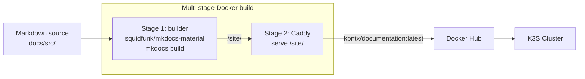

# Documentation

This documentation site is built with **MkDocs Material** and served via **Caddy** inside the cluster.

**URL:** docs.kbntx.com
**Source:** `docs/`

## Build pipeline



The build is entirely self-contained in the Dockerfile — no local MkDocs installation needed.

## Local development

```bash
cd docs
docker compose up --build
# Visit http://localhost:8000
# Live reload on file changes (src/ is mounted as a volume)
```

The `docker-compose.yml` uses `Dockerfile.local` which runs `mkdocs serve` with hot-reload. Changes to Markdown files update the browser automatically.

## Structure

```
docs/
├── src/                    # All documentation content
│   ├── index.md            # Home page
│   ├── onboarding/         # Getting started
│   └── platform/           # Platform component docs
├── mkdocs.yml              # MkDocs configuration
├── Dockerfile              # Production build (MkDocs → static → Caddy)
├── Dockerfile.local        # Local development (mkdocs serve)
├── docker-compose.yml      # Local dev compose
├── Caddyfile               # Caddy config for production
└── helm/                   # Kubernetes deployment chart
    ├── Chart.yaml
    └── templates/
        └── template.yaml   # Deployment + Service + Ingress + PDB
```

## Deployment

Triggered by `.github/workflows/deploy-documentation.yml`:

1. `buildctl` builds and pushes `kbntx/documentation:latest` (using `docs/` as context)
2. ArgoCD syncs the Helm chart at `docs/helm/`
3. Rolling update with pod restart to force re-pull of `:latest`

The deployment runs 2 replicas with a `PodDisruptionBudget` of `minAvailable: 1` to ensure zero-downtime updates.

## Writing docs

- Content goes in `docs/src/` as Markdown files
- The `awesome-nav` plugin automatically discovers files and builds the navigation
- Mermaid diagrams are supported via fenced code blocks with ` ```mermaid `
- Admonitions (`!!! tip`, `!!! warning`, etc.) are available

### Admonition types

```markdown
!!! tip "Pro tip"
Use this for helpful hints.

!!! warning
Use this for important caveats.

!!! danger "Careful"
Use this for dangerous operations.
```
