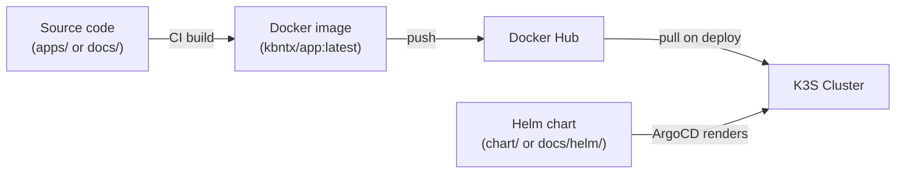

# Applications

Nexus hosts several applications on the platform. Each application follows the same deployment pattern: built in CI, packaged as a Docker image, pushed to Docker Hub, and deployed to the cluster via ArgoCD.

## Applications

| Application                       | URL                 | Stack                   | Path              |
| --------------------------------- | ------------------- | ----------------------- | ----------------- |
| [Portfolio](portfolio.md)         | portfolio.kbntx.com | Angular 20 + Caddy      | `apps/portfolio/` |
| [Documentation](documentation.md) | docs.kbntx.com      | MkDocs Material + Caddy | `docs/`           |
| Homepage                          | homepage.kbntx.com  | —                       | `apps/homepage/`  |

## Deployment pattern

All applications share the same deployment pattern:

Each application has:

- A **Dockerfile** that produces a static-file-serving container (Caddy)
- A **Helm chart** for Kubernetes deployment (Deployment + Service + Ingress + PDB)
- A **GitHub Actions workflow** that builds, pushes, and deploys on changes to `main`
