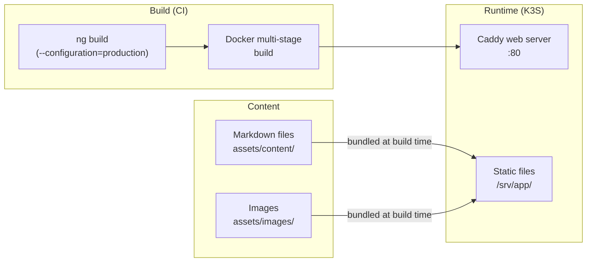

# Portfolio

The portfolio is an **Angular 20** single-page application that serves as a personal showcase — projects, experience, and skills. It reads content from Markdown files at build time.

**URL:** portfolio.kbntx.com
**Source:** `apps/portfolio/`

## Architecture



The app is **fully static** — there is no backend. Content is loaded as JSON from pre-built Markdown files using `marked` for rendering and `shiki` for syntax highlighting.

## Structure

```
apps/portfolio/src/
├── app/
│   ├── pages/
│   │   ├── home/           # Landing page + skills grid
│   │   ├── projects/       # Project cards + detail modal
│   │   └── experiences/    # Career timeline
│   └── shared/
│       ├── components/
│       │   ├── navigation/ # Top nav bar
│       │   └── theme-toggle/
│       └── services/
│           ├── projects.service.ts  # Loads project Markdown
│           └── theme.service.ts     # Dark/light theme
└── assets/
    ├── content/
    │   ├── home/index.md
    │   └── projects/       # One .md file per project
    ├── images/             # Profile photo, CV pages
    └── pdfs/               # CV PDF
```

## Adding a new project

1. Create a Markdown file under `apps/portfolio/src/assets/content/projects/`:

```markdown
---
title: My New Project
date: 2024-01-01
tags: [kubernetes, terraform]
---

Project description here...
```

2. The `ProjectsService` discovers and loads all `.md` files in that directory automatically. No code change needed.

## Build

```bash
# Development server
pnpm nx serve portfolio

# Production build
pnpm nx build portfolio --configuration=production
# Output: dist/apps/portfolio/browser/
```

## Docker build

The Dockerfile uses a multi-stage build:

1. **Stage 1** — not applicable (build happens in CI before Docker)
2. **Stage 2** — Caddy serves the pre-built `dist/` output

The Caddy configuration (`apps/portfolio/Caddyfile`) sets long cache headers for assets and `no-store` for HTML to support SPA routing.

## Deployment

Triggered by `.github/workflows/deploy-portfolio.yml` on push to `main`:

1. `pnpm nx build portfolio --configuration=production`
2. `buildctl` builds and pushes `kbntx/portfolio:latest`
3. ArgoCD syncs the Helm chart at `apps/portfolio/chart/`
4. Rolling update with pod restart to force re-pull of `:latest`
