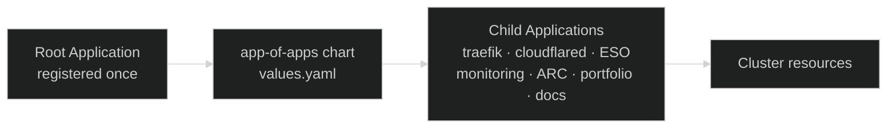

[ArgoCD](https://argo-cd.readthedocs.io/){ target="\_blank" rel="noopener" }
is the **GitOps reconciler** that owns the cluster. Every workload that
runs in Nexus — Traefik, Cloudflare Tunnel, External Secrets, monitoring,
the runner pool, the docs site, the portfolio — exists because ArgoCD
read its definition from this repo and applied it. The cluster state is a
pure function of `main`.

That single property is the reason for the choice:

- **Drift is structurally impossible.** A manual `kubectl apply` would be
  reverted on the next reconcile loop. The cluster cannot diverge from
  Git without ArgoCD shouting about it.
- **Rollback is one revert.** Bad change goes in, `git revert`, ArgoCD
  syncs back. No imperative undo, no half-rolled-out state.
- **Onboarding a new component is a YAML file.** No cluster access, no
  `helm install`, no out-of-band steps. Add an entry, push, done.
- **One audit trail.** Git history _is_ the deploy history.

## The app-of-apps pattern

Registering each `Application` manually would defeat the point — the
catalog of cluster workloads would itself live outside Git. Instead,
**a single root `Application` is registered by hand once at bootstrap**,
and that root points at the
[`app-of-apps`](https://github.com/kbntx/nexus/tree/main/platform/services/app-of-apps){ target="\_blank" rel="noopener" }
chart. The chart wraps
[`argocd-apps`](https://github.com/argoproj/argo-helm/tree/main/charts/argocd-apps){ target="\_blank" rel="noopener" }
and declares every other `Application` the platform needs as a child.



Bootstrapping the platform is a single sync of the root application. Every
core component declared in
[`app-of-apps/values.yaml`](https://github.com/kbntx/nexus/blob/main/platform/services/app-of-apps/values.yaml){ target="\_blank" rel="noopener" }
is then materialized by ArgoCD on its own. Adding a new workload — see
[Adding an application](#adding-an-application) below — is one entry in
that file.

## Sync model

Two sync modes live side by side, and the split is intentional.

| Workload                                                                        | Mode                         | Why                                                                                          |
| ------------------------------------------------------------------------------- | ---------------------------- | -------------------------------------------------------------------------------------------- |
| **Platform components** (Traefik, Cloudflared, ESO, monitoring, ARC, upgrades…) | Auto-sync on Git changes     | Their manifests _are_ the source of truth — converging immediately is the desired behavior   |
| **Custom apps shipping images** (portfolio, docs)                               | Manual sync, triggered by CI | The Git change (image tag bump) and the image push must complete _before_ the rollout starts |

For custom apps, leaving auto-sync off keeps deploys
**imperative-on-demand**: ArgoCD does not race the registry, and the CI
pipeline is the single thing that decides "this commit is ready to roll
out." Once CI has built and pushed the image, it explicitly tells ArgoCD
to sync — see [CI integration](#ci-integration).

## Hotfix via parameter overrides

A useful side effect of routing image tags through ArgoCD: production can
be unblocked from the UI or CLI without touching CI.

```bash
argocd app set portfolio -p image.tag=<known-good-tag>
argocd app sync portfolio
```

ArgoCD records the override on the live `Application` and rolls out the
chosen tag immediately. The Git manifest is now temporarily out of step
with the cluster — the UI flags it as `OutOfSync` on the parameter — and
the fix is to **mirror the override back into Git** (a values bump or a
revert) on the next commit. From that point forward syncs are no-ops
until the next real change.

The point is that the door is there when production is on fire and CI is
the slow path. Used responsibly, it is an emergency lever, not a
workflow.

## CI integration

Custom apps roll out through the same three-step pattern in every deploy
workflow: bump the image tag as a parameter override, sync, wait for
healthy.

```yaml
- name: Deploy
  env:
    ARGOCD_SERVER: ${{ vars.ARGOCD_SERVER }}
    ARGOCD_AUTH_TOKEN: ${{ secrets.ARGOCD_TOKEN }}
    ARGOCD_OPTS: '--grpc-web'
  run: |
    argocd app set portfolio -p image.tag=${{ inputs.image_tag }}
    argocd app sync portfolio --prune
    argocd app wait portfolio --sync --health --operation
```

Excerpted from
[`deploy-portfolio.yml`](https://github.com/kbntx/nexus/blob/main/.github/workflows/deploy-portfolio.yml){ target="\_blank" rel="noopener" },
which is the canonical template for any image-shipping app.

A few things to note:

- **GHA bumps the parameter, ArgoCD does the deploy.** The runner does
  not `kubectl apply` anything — it only nudges ArgoCD. This keeps the
  cluster reachable from a single identity (the `ci` account, see
  [Access](#access)) and the rollout logic in one place.
- **`--prune`** removes resources that no longer exist in the chart.
  Without it, deleted manifests would linger in the cluster forever.
- **`app wait --health`** is what makes the workflow fail loudly when a
  rollout misbehaves: the pipeline does not turn green until ArgoCD
  reports the `Application` healthy.

Image tags are not committed to Git for these apps — they live as
parameter overrides on the live `Application`, and the next sync from a
real Git change will preserve them as long as `image.tag` is the only
override.

## Adding an application

The whole flow for a new cluster-side workload:

1. Drop the chart or raw manifests under `platform/services/<name>/`
   (or `platform/core/<name>/` if the cluster cannot function without it).
2. Add an entry under `argocd-apps.applications` in
   [`app-of-apps/values.yaml`](https://github.com/kbntx/nexus/blob/main/platform/services/app-of-apps/values.yaml){ target="\_blank" rel="noopener" },
   pointing `source.path` at the chart and setting the destination
   namespace.
3. Push to `main`. The `app-of-apps` `Application` re-syncs, the new
   child `Application` is created, and ArgoCD reconciles it into the
   cluster.

There is no step where someone manually clicks "create application" in
the UI — every app on the cluster traces back to a line in that values
file.

## Access

The ArgoCD UI and gRPC API are exposed through
[`templates/ingress.yaml`](https://github.com/kbntx/nexus/blob/main/platform/core/argocd/templates/ingress.yaml){ target="\_blank" rel="noopener" },
fronted by Cloudflare like every other public service (see
[Networking](../networking/01-overview.md)).

Two identities exist, and both are configured in
[`platform/core/argocd/values.yaml`](https://github.com/kbntx/nexus/blob/main/platform/core/argocd/values.yaml){ target="\_blank" rel="noopener" }:

- **Humans** authenticate through GitHub SSO via the bundled
  [Dex](https://dexidp.io/){ target="\_blank" rel="noopener" }
  connector. The local `admin` account is disabled. RBAC maps the
  `platform` team in the GitHub org to `role:admin`, so granting access
  is a GitHub team membership change rather than an ArgoCD config edit.
- **CI** uses a scoped `ci` API-key account. Its RBAC role is limited to
  `get`, `sync`, `update`, and the `Deployment` restart action on
  applications in the `default` project — exactly what the deploy
  workflows need, nothing more. The token lives in GitHub Actions
  secrets as `ARGOCD_TOKEN`.

## References

- [`platform/core/argocd/`](https://github.com/kbntx/nexus/tree/main/platform/core/argocd){ target="\_blank" rel="noopener" } — ArgoCD Helm chart wrapper, ingress template, SSO + RBAC config
- [`platform/services/app-of-apps/`](https://github.com/kbntx/nexus/tree/main/platform/services/app-of-apps){ target="\_blank" rel="noopener" } — root chart declaring every child `Application`
- [`platform/services/app-of-apps/values.yaml`](https://github.com/kbntx/nexus/blob/main/platform/services/app-of-apps/values.yaml){ target="\_blank" rel="noopener" } — the catalog of cluster workloads
- [`.github/workflows/deploy-portfolio.yml`](https://github.com/kbntx/nexus/blob/main/.github/workflows/deploy-portfolio.yml){ target="\_blank" rel="noopener" } — canonical CI deploy pattern (`app set` → `app sync` → `app wait`)
