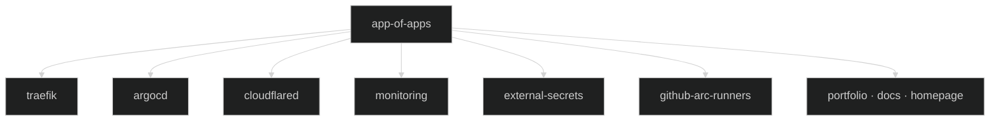

## What is ArgoCD?

ArgoCD is a **GitOps continuous delivery tool** for Kubernetes. It watches a Git repository and continuously reconciles the cluster state with the desired state declared in that repo. The cluster always converges to what is in the `main` branch — no manual `kubectl apply` in production.

## App-of-Apps Pattern

Rather than registering each component in ArgoCD one by one, a single root application (`app-of-apps`) manages all others. To deploy something new to the cluster, you add it to `platform/services/app-of-apps/values.yaml` — ArgoCD picks it up automatically.



The root application is deployed at [`platform/services/app-of-apps/`](https://github.com/kbntx-org/nexus/tree/main/platform/services/app-of-apps).

## Sync Strategies

| Type                                                  | Strategy                         | Why                                                                   |
| ----------------------------------------------------- | -------------------------------- | --------------------------------------------------------------------- |
| Infrastructure components (Traefik, ESO, monitoring…) | **Auto-sync**                    | Changes are always intentional; let ArgoCD converge immediately       |
| Applications (portfolio, docs…)                       | **Manual sync, triggered by CI** | The image must be pushed and the manifest updated before ArgoCD syncs |

For applications, the CI pipeline calls `argocd app sync` after a successful build. This ensures the new image exists before the rollout starts.

## Adding a New Component

1. Create a Helm chart or raw manifests at `platform/services/<component>/` (or `platform/core/<component>/` if it's required for the cluster to function)
2. Add an entry in [`platform/services/app-of-apps/values.yaml`](https://github.com/kbntx-org/nexus/blob/main/platform/services/app-of-apps/values.yaml):

```yaml
argocd-apps:
  applications:
    my-component:
      source:
        repoURL: https://github.com/kbntx-org/nexus.git
        path: platform/services/my-component
        targetRevision: main
      destination:
        namespace: my-component
      syncPolicy:
        syncOptions:
          - CreateNamespace=true
```

3. Push to `main` — ArgoCD deploys the new application automatically.

## Useful CLI Commands

```bash
# Sync an application (CI usage)
argocd app sync portfolio --prune

# Wait for healthy state
argocd app wait portfolio --sync --health --operation --timeout 500

# Force a pod restart without changing the manifest
argocd app actions run portfolio restart \
  --kind Deployment \
  --resource-name portfolio \
  --namespace portfolio
```

!!! tip "Always use --prune"
The `--prune` flag on sync removes Kubernetes resources that no longer exist in Git. Without it, deleted resources linger in the cluster.

## References

- [`platform/core/argocd/`](https://github.com/kbntx-org/nexus/tree/main/platform/core/argocd) — ArgoCD Helm chart wrapper
- [`platform/services/app-of-apps/`](https://github.com/kbntx-org/nexus/tree/main/platform/services/app-of-apps) — root application definition
- [ArgoCD documentation](https://argo-cd.readthedocs.io/en/stable/)
