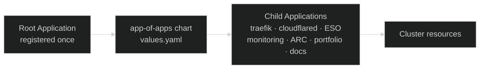

[ArgoCD](https://argo-cd.readthedocs.io/){ target="\_blank" rel="noopener" }
is the **GitOps reconciler** that owns the cluster. Every workload that
runs in Nexus — Traefik, Cloudflare Tunnel, External Secrets, monitoring,
the runner pool, the docs site, the portfolio — exists because ArgoCD
read its definition from this repo and applied it. The cluster state is a
pure function of `main`.

That single property is the reason for the choice:

- **Drift is structurally impossible.** A manual `kubectl apply` would be
  reverted on the next reconcile loop. The cluster cannot diverge from
  Git without ArgoCD shouting about it.
- **Rollback is one revert.** Bad change goes in, `git revert`, ArgoCD
  syncs back. No imperative undo, no half-rolled-out state.
- **Onboarding a new component is a YAML file.** No cluster access, no
  `helm install`, no out-of-band steps. Add an entry, push, done.
- **One audit trail.** Git history _is_ the deploy history.

## The app-of-apps pattern

Registering each `Application` manually would defeat the point — the
catalog of cluster workloads would itself live outside Git. Instead,
**a single root `Application` is registered by hand once at bootstrap**,
and that root points at the
[`app-of-apps`](https://github.com/kbntx-org/nexus/tree/main/platform/services/app-of-apps){ target="\_blank" rel="noopener" }
chart. The chart wraps
[`argocd-apps`](https://github.com/argoproj/argo-helm/tree/main/charts/argocd-apps){ target="\_blank" rel="noopener" }
and declares every other `Application` the platform needs as a child.



Bootstrapping the platform is a single sync of the root application. Every
core component declared in
[`app-of-apps/values.yaml`](https://github.com/kbntx-org/nexus/blob/main/platform/services/app-of-apps/values.yaml){ target="\_blank" rel="noopener" }
is then materialized by ArgoCD on its own. Adding a new workload — see
[Adding an application](#adding-an-application) below — is one entry in
that file.

## Sync model

Every Application is auto-synced. The source of "what should be live"
differs by workload type:

| Workload                                                                        | Source of truth                             | Why                                                                                                |
| ------------------------------------------------------------------------------- | ------------------------------------------- | -------------------------------------------------------------------------------------------------- |
| **Platform components** (Traefik, Cloudflared, ESO, monitoring, ARC, upgrades…) | This repo (single-source `Application`)     | Their manifests _are_ the source of truth — converging on every Git change is the desired behavior |
| **Custom apps shipping images** (portfolio, docs)                               | This repo (chart) + `nexus-manifests` (tag) | The image tag is decoupled from the chart so CI can bump it atomically per commit                  |

The custom apps use a [multi-source `Application`](https://argo-cd.readthedocs.io/en/stable/user-guide/multiple_sources/){ target="\_blank" rel="noopener" }:
the chart comes from this repo, and a values overlay
(`$values/<app>/values.yaml`) comes from
[`nexus-manifests`](https://github.com/kbntx-org/nexus-manifests){ target="\_blank" rel="noopener" } —
a small, dumb repo CI commits image-tag bumps to. ArgoCD is notified of
those commits via a GitHub webhook for sub-minute sync. See
[GitOps deploys](../ci-cd/02-gitops-deploys.md) for the full pipeline.

## Hotfix via parameter overrides

The door is still open when production is on fire and CI is the slow
path:

```bash
argocd app set portfolio -p image.tag=<known-good-tag>
```

The override lands on the live `Application` and rolls out immediately.
For multi-source apps, the parameter targets the chart source (index 0)
and shadows whatever `nexus-manifests` says — so the override is sticky
until you `argocd app unset` or commit the same tag back to
`nexus-manifests`.

This works because [`argocd-cm`](https://github.com/kbntx-org/nexus/blob/main/platform/core/argocd/values.yaml){ target="\_blank" rel="noopener" }
declares `ignoreApplicationDifferences` for `/spec/sources/0/helm/parameters`
on portfolio and documentation. Without that, the parent app-of-apps
reconciler would revert the override on its next sync. Used
responsibly, it is an emergency lever, not a workflow.

## CI integration

CI does not touch ArgoCD directly anymore. The deploy pipeline builds
images, pushes them, and commits the new tags to `nexus-manifests`;
ArgoCD picks them up on its own. See
[GitOps deploys](../ci-cd/02-gitops-deploys.md) for the full mechanics
and the rationale behind the split repo.

## Adding an application

The whole flow for a new cluster-side workload:

1. Drop the chart or raw manifests under `platform/services/<name>/`
   (or `platform/core/<name>/` if the cluster cannot function without it).
2. Add an entry under `argocd-apps.applications` in
   [`app-of-apps/values.yaml`](https://github.com/kbntx-org/nexus/blob/main/platform/services/app-of-apps/values.yaml){ target="\_blank" rel="noopener" },
   pointing `source.path` at the chart and setting the destination
   namespace.
3. Push to `main`. The `app-of-apps` `Application` re-syncs, the new
   child `Application` is created, and ArgoCD reconciles it into the
   cluster.

There is no step where someone manually clicks "create application" in
the UI — every app on the cluster traces back to a line in that values
file.

## Access

The ArgoCD UI and gRPC API are exposed through
[`templates/ingress.yaml`](https://github.com/kbntx-org/nexus/blob/main/platform/core/argocd/templates/ingress.yaml){ target="\_blank" rel="noopener" },
fronted by Cloudflare like every other public service (see
[Networking](../networking/01-overview.md)).

Two identities exist, and both are configured in
[`platform/core/argocd/values.yaml`](https://github.com/kbntx-org/nexus/blob/main/platform/core/argocd/values.yaml){ target="\_blank" rel="noopener" }:

- **Humans** authenticate through GitHub SSO via the bundled
  [Dex](https://dexidp.io/){ target="\_blank" rel="noopener" }
  connector. The local `admin` account is disabled. RBAC maps the
  `platform` team in the GitHub org to `role:admin`, so granting access
  is a GitHub team membership change rather than an ArgoCD config edit.
- **CI** uses a scoped `ci` API-key account. Its RBAC role is limited to
  `get`, `sync`, `update`, and the `Deployment` restart action on
  applications in the `default` project — exactly what the deploy
  workflows need, nothing more. The token lives in GitHub Actions
  secrets as `ARGOCD_TOKEN`.

## References

- [`platform/core/argocd/`](https://github.com/kbntx-org/nexus/tree/main/platform/core/argocd){ target="\_blank" rel="noopener" } — ArgoCD Helm chart wrapper, ingress template, SSO + RBAC config
- [`platform/services/app-of-apps/`](https://github.com/kbntx-org/nexus/tree/main/platform/services/app-of-apps){ target="\_blank" rel="noopener" } — root chart declaring every child `Application`
- [`platform/services/app-of-apps/values.yaml`](https://github.com/kbntx-org/nexus/blob/main/platform/services/app-of-apps/values.yaml){ target="\_blank" rel="noopener" } — the catalog of cluster workloads
- [GitOps deploys](../ci-cd/02-gitops-deploys.md) — multi-source `Application` shape and the `nexus-manifests` flow
