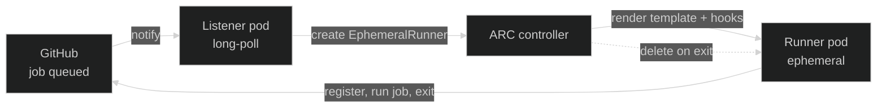
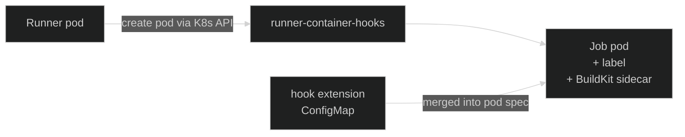
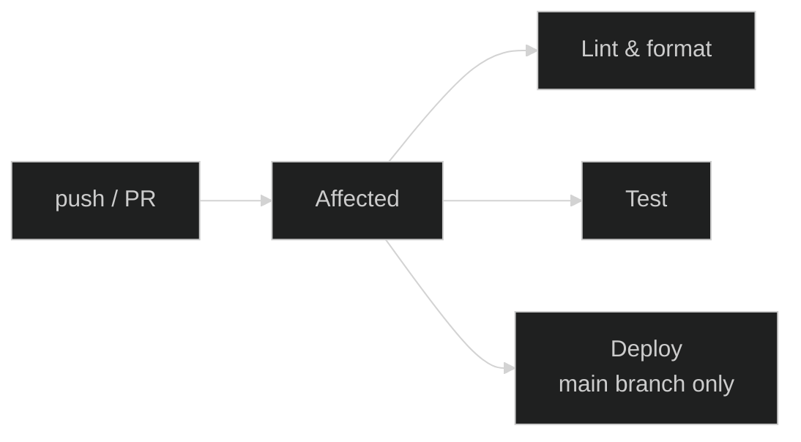

## Why GitHub Actions

CI/CD runs on
[GitHub Actions](https://docs.github.com/en/actions){ target="\_blank" rel="noopener" }.
A few reasons drive the choice:

- **Colocated with the source.** Nexus is already hosted on GitHub, so
  CI lives next to the code, the PRs, and the issues — one platform, one
  set of permissions, no extra integration to wire up.
- **Best PR experience on the market.** Tight integration with branch
  protection, review tooling, status checks, and reusable workflows. The
  developer flow stays inside the same UI as the code.
- **Native fit with Kubernetes.** Pipelines run on **self-hosted runners
  inside the cluster** — no external CI provider, no per-minute billing,
  and CI compute is part of the same GitOps-managed workload as everything
  else.

## Runners

CI jobs are executed by
[Actions Runner Controller (ARC)](https://github.com/actions/actions-runner-controller){ target="\_blank" rel="noopener" },
a Kubernetes operator that creates an **ephemeral runner pod** for each job
and deletes it when the job finishes.

A workflow opts into the in-cluster runners by targeting the registered
runner scale set:

```yaml
jobs:
  build:
    runs-on: nexus-runners
    container:
      image: kbntx/nexus-ci-toolkit:1.0
```

`nexus-runners` is the
[`runnerScaleSetName`](https://github.com/kbntx/nexus/blob/main/platform/core/github-arc-runners/runners/values.yaml){ target="\_blank" rel="noopener" }
exposed by the runner chart. The container image is the
[CI toolkit](#ci-toolkit-image) — the single image used by every workflow.

### How ARC works

Two long-lived components run in the cluster: a **controller** that
watches the runner-scale-set CRDs, and a **listener** pod per scale set
that holds an HTTPS long-poll connection to GitHub. When GitHub queues a
job for `nexus-runners`, the flow is:



The runner pod is **single-use**: once the job finishes, the pod is
discarded. There is no shared state between jobs, no warm caches between
runs, and no opportunity for one job to leave behind something that
affects the next one.

The pool size scales between `minRunners` and `maxRunners` (configured in
the [runner values](https://github.com/kbntx/nexus/blob/main/platform/core/github-arc-runners/runners/values.yaml){ target="\_blank" rel="noopener" }):
the listener creates new ephemeral runners as jobs queue up, the
controller materializes them as pods, and idle slack is pruned back down.

### Dedicated node pool

Runner pods schedule onto a **dedicated node pool**. The runner spec sets
a `nodeSelector` (`pool: ci-runners`) and tolerates a matching taint, so:

- CI workloads cannot land on application nodes
- Application workloads cannot land on runner nodes
- Resource pressure from a noisy job stays within its blast radius

### Container hooks

Whenever a workflow uses a job container, a service container, or a
Docker action, the actions runner does not create those pods itself —
it delegates to
[runner-container-hooks](https://github.com/actions/runner-container-hooks){ target="\_blank" rel="noopener" }.
The Kubernetes implementation of those hooks talks to the Kubernetes API
and spins up a new pod in the runner's namespace for each one.

That covers the _creation_ of job pods, but not _what they look like_.
For that, ARC supports a
[**hook extension template**](https://docs.github.com/en/actions/hosting-your-own-runners/managing-self-hosted-runners-with-actions-runner-controller/deploying-runner-scale-sets-with-actions-runner-controller#using-hook-extensions){ target="\_blank" rel="noopener" }
— a YAML file pointed at by the `ACTIONS_RUNNER_CONTAINER_HOOK_TEMPLATE`
environment variable. Whatever lives in that file is **merged into every
pod the hooks create**, on top of the defaults the runner would generate.



In Nexus, the template is shipped as a ConfigMap mounted into the runner
([`hook-extension.yaml`](https://github.com/kbntx/nexus/blob/main/platform/core/github-arc-runners/runners/templates/hook-extension.yaml){ target="\_blank" rel="noopener" })
and used for two things — both of which would be painful to solve any
other way:

- **Network isolation.** The extension adds a `github-job-pod: 'true'`
  label to every job pod. A
  [`NetworkPolicy`](https://github.com/kbntx/nexus/blob/main/platform/core/github-arc-runners/runners/templates/network-policy.yaml){ target="\_blank" rel="noopener" }
  selects on that label and restricts egress: DNS to `kube-system` and
  the public internet are allowed, the cluster's pod and service
  networks are denied. Even on their own pool, runners execute
  arbitrary user-authored code (workflow YAML, pulled actions, build
  scripts) — treating them as untrusted is the safe default. In
  practice, a runner can pull from GitHub, push to a registry, or call
  ArgoCD over its public ingress, but it cannot reach in-cluster
  services directly.
- **BuildKit sidecar.** The extension sideloads a
  [BuildKit](https://github.com/moby/buildkit){ target="\_blank" rel="noopener" }
  init container and exports `BUILDKIT_HOST` to the job container. Every
  workflow gets rootless image builds out of the box, without each one
  having to set up its own builder.

The same template also detects "step pods" (Docker actions that run as
their own pod) and skips the BuildKit sidecar for them — the sidecar is
only useful for the main job container.

## CI toolkit image

Every workflow uses one image,
[`kbntx/nexus-ci-toolkit`](https://github.com/kbntx/nexus/tree/main/platform/services/custom-docker-images){ target="\_blank" rel="noopener" },
that bundles every tool the pipelines need: `pnpm`, `kubectl`, the ArgoCD
CLI, BuildKit client, `jq`, and so on.

This avoids per-job setup steps (no `setup-node`, no `setup-go`, no
manual installs) and keeps the workflow files short. When a tool needs to
be added, it goes into the toolkit image and every workflow benefits at
once.

## Pipelines

The pipelines are split into a small set of reusable workflows that
[`checks-pr.yml`](https://github.com/kbntx/nexus/blob/main/.github/workflows/checks-pr.yml){ target="\_blank" rel="noopener" }
and
[`checks-main.yml`](https://github.com/kbntx/nexus/blob/main/.github/workflows/checks-main.yml){ target="\_blank" rel="noopener" }
compose. Both start by computing what changed.



### PR pipeline

On a pull request:

1. **Affected** — figure out which Nx projects are impacted by the diff
   against the base branch.
2. **Lint & format** — run `nx affected --target=lint` and a global
   `nx format:check` on the affected set.
3. **Test** — run `nx affected --target=test` on the same set.

Branch protection blocks merging until all three pass. Nothing is built
or deployed from a PR.

### Main pipeline

On a push to `main`, the same three steps run, then per-app **build**
jobs fan out for the projects flagged for deployment, an aggregator
commits the new image tags to a separate manifests repo, and ArgoCD
deploys via auto-sync. The full flow is documented in
[GitOps deploys](02-gitops-deploys.md).

## Affected detection

[Nx](https://nx.dev/){ target="\_blank" rel="noopener" } already knows the
project graph and can answer "what changed since `<base>`?". The CI
pipelines lean on that for two distinct decisions:

- **What to lint and test** — straightforward `nx affected` against the
  base branch.
- **What to deploy** — Nx affected, _plus_ any project whose declared
  **deploy paths** intersect the changed files. This catches changes that
  Nx alone cannot see, like a Helm chart edit or a workflow tweak that
  should still trigger a redeploy.

Each project declares its deploy paths in its `project.json` under
`metadata.deployPaths`, and
[`compute-affected.yml`](https://github.com/kbntx/nexus/blob/main/.github/workflows/compute-affected.yml){ target="\_blank" rel="noopener" }
walks them with the changed file list to build `deploy_targets`. On
`main`, the diff base for image-shipping apps is **that app's last
deployed SHA** (read from the manifests repo), not the previous commit
— this prevents parallel merges from cross-referencing each other's
in-flight images. See
[GitOps deploys](02-gitops-deploys.md) for the full mechanics.

The workflow also has a fail-safe: if it modifies itself, it marks
**every application** as a deploy target — the assumption being that a
change to the affected logic is risky enough to warrant a full re-deploy.

## References

- [`platform/core/github-arc-runners/`](https://github.com/kbntx/nexus/tree/main/platform/core/github-arc-runners){ target="\_blank" rel="noopener" } — ARC controller and runner Helm charts
- [`platform/core/github-arc-runners/runners/templates/network-policy.yaml`](https://github.com/kbntx/nexus/blob/main/platform/core/github-arc-runners/runners/templates/network-policy.yaml){ target="\_blank" rel="noopener" } — runner egress restrictions
- [`platform/core/github-arc-runners/runners/templates/hook-extension.yaml`](https://github.com/kbntx/nexus/blob/main/platform/core/github-arc-runners/runners/templates/hook-extension.yaml){ target="\_blank" rel="noopener" } — `github-job-pod` label + BuildKit injection
- [`platform/services/custom-docker-images/`](https://github.com/kbntx/nexus/tree/main/platform/services/custom-docker-images){ target="\_blank" rel="noopener" } — CI toolkit image
- [`.github/workflows/`](https://github.com/kbntx/nexus/tree/main/.github/workflows){ target="\_blank" rel="noopener" } — workflow definitions
- [`.github/workflows/compute-affected.yml`](https://github.com/kbntx/nexus/blob/main/.github/workflows/compute-affected.yml){ target="\_blank" rel="noopener" } — affected detection (per-app base from `nexus-manifests` on main)
