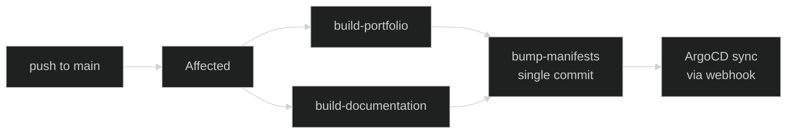

Image-shipping apps (portfolio, documentation) are deployed through a
**separate manifests repo** rather than through CI patching ArgoCD
directly. This page explains why, what the repo looks like, and how a
push to `main` reaches the cluster.

## Why a separate repo

The previous flow had CI compute "what's affected" against
`github.event.before` (the previous commit on `main`), then call
`argocd app set` to bump image tags imperatively. Two problems compound
when merges land in parallel:

- The diff base for build B is the commit produced by build A. If B's
  manifest is computed before A finishes pushing its image, B's
  deploy can reference an image that does not yet exist in the
  registry.
- GitHub Actions concurrency cannot enforce strict FIFO across more than
  two in-flight runs (queue depth is one). Cancelling later runs is not
  acceptable either — every merged commit must deploy.

The fix is to make each build's deploy decision **self-contained**: an
app is rebuilt iff its files changed since _that app's own_ last
successful deploy, not since the previous commit. The cleanest source of
truth for "last successful deploy per app" is a small, dumb git repo
that ArgoCD reads as a values overlay.

## The two repos

[`nexus`](https://github.com/kbntx/nexus){ target="\_blank" rel="noopener" }
holds code, charts, and workflows. Unchanged in shape.

[`nexus-manifests`](https://github.com/kbntx/nexus-manifests){ target="\_blank" rel="noopener" }
holds one tiny file per ArgoCD-managed app:

```
documentation/values.yaml   →   image: { tag: <sha> }
portfolio/values.yaml       →   image: { tag: <sha> }
```

No `Chart.yaml`, no templates, no environment overlays. Its git history
is the deploy log: every commit is a tag bump on one or more apps.
Rollback is `git revert` on this repo.

## Multi-source `Application`

Each image-shipping app is registered as a
[multi-source ArgoCD Application](https://argo-cd.readthedocs.io/en/stable/user-guide/multiple_sources/){ target="\_blank" rel="noopener" }
in
[`platform/services/app-of-apps/values.yaml`](https://github.com/kbntx/nexus/blob/main/platform/services/app-of-apps/values.yaml){ target="\_blank" rel="noopener" }.
Two sources combine:

- The chart from `nexus` at the same path as before
  (`apps/portfolio/chart`, `docs/helm`).
- A values overlay from `nexus-manifests`, declared as a `ref` source so
  the chart can read it via `$values/<app>/values.yaml` in
  `helm.valueFiles`.

Auto-sync is enabled. A push to `nexus-manifests` triggers an ArgoCD
sync via a GitHub webhook (no waiting for the default poll interval).
The cluster cannot drift from the manifests repo — ArgoCD self-heals
back to whatever the file says, so a manual `argocd app set` is no
longer in the picture.

## Pipeline shape



CI is fire-and-forget: it pushes images, commits the new tags, and
exits. Watching the rollout is ArgoCD's job — its UI and any monitoring
on top of it own the rollout-health story.

`build-<app>` jobs build and push images tagged with the commit SHA.
They no longer talk to ArgoCD.

[`bump-manifests.yml`](https://github.com/kbntx/nexus/blob/main/.github/workflows/bump-manifests.yml){ target="\_blank" rel="noopener" }
is the aggregator. It depends on every build job, edits each affected
app's values file in `nexus-manifests`, and produces **one commit per
wave** (not one per app). The commit message lists each project and its
new tag. Push uses a rebase-retry loop so two waves landing back-to-back
serialize cleanly at the git layer.

The job is **all-or-nothing**: any build failure short-circuits the
gate and no commit is made. Partial deploys are not a state the system
can be in.

## Affected detection per app

[`compute-affected.yml`](https://github.com/kbntx/nexus/blob/main/.github/workflows/compute-affected.yml){ target="\_blank" rel="noopener" }
clones `nexus-manifests` shallowly, then for each project:

1. Reads `metadata.manifestsValuesPath` from the project's
   `project.json` (the per-app file in `nexus-manifests`).
2. Reads `image.tag` from that file with `yq`.
3. Diffs the project's `metadata.deployPaths` between that SHA and
   `HEAD`. If any matched, the project is added to `deploy_targets`.

If the values file does not exist (bootstrap, new app), the diff base
falls back to the empty git tree — every tracked file counts as added,
so the app is queued for first deploy. If the recorded SHA is no longer
reachable in `nexus`, the same fallback applies.

PR mode is unchanged: base is the merge target's `HEAD`, and the
manifests repo is not consulted (PRs do not deploy).

## Auth

A `nexus-ci` GitHub App is installed on both repos with `Contents:
Read & write` on `nexus-manifests`. Workflows mint short-lived
installation tokens via
[`actions/create-github-app-token`](https://github.com/actions/create-github-app-token){ target="\_blank" rel="noopener" }
on the fly — `compute-affected` for the read-side clone, `bump-manifests`
for the write. The App ID and private key live as repo secrets in
`nexus`.

## Rollback and hotfix

The manifests repo is small, dumb, and human-editable. Three options
when production needs to move:

- **Revert in `nexus-manifests`** — `git revert <commit>` restores the
  previous tag; ArgoCD picks it up via the webhook within seconds.
- **Edit by hand** — bump `image.tag` in the affected file to a known-good
  SHA and push. Same effect, useful when the bad commit was the result of
  several rolled into one.
- **Re-run CI** for the desired `nexus` commit — re-pushes the image (or
  no-ops on a cache hit) and re-bumps the manifests repo.

`argocd app set` is _not_ an option anymore: `selfHeal: true` on the
Application would revert the override on the next reconcile. The
manifests repo is the source of truth.

## Pull requests

PRs run the same `compute-affected → build → bump-manifests` chain as
`main`, with two differences:

- **Image tag = PR head SHA** (`github.event.pull_request.head.sha`),
  so the image is reproducible to the exact code under review rather
  than the artificial merge commit.
- **`bump-manifests` writes to `pr-<number>`** in `nexus-manifests`
  instead of `main`. The branch is created from `main` on the first
  PR build, then re-used for subsequent pushes — so unchanged apps in
  the preview inherit `main`'s tag, and changed apps carry the PR head.

The diff base for the per-app deploy gate stays the PR's merge target
(`origin/<base_ref>`) — ArgoCD's last-deployed SHA from `main` is
_not_ consulted for PRs. We want the preview to reflect the PR's diff
against trunk, not against the live cluster.

[`cleanup-pr-manifests.yml`](https://github.com/kbntx/nexus/blob/main/.github/workflows/cleanup-pr-manifests.yml){ target="\_blank" rel="noopener" }
deletes `pr-<number>` from `nexus-manifests` when the PR closes
(merged or not). The deletion is idempotent — PRs that never built a
preview return cleanly.

What is _not_ yet wired:

- The
  [ApplicationSet PullRequest generator](https://argo-cd.readthedocs.io/en/stable/operator-manual/applicationset/Generators-Pull-Request/){ target="\_blank" rel="noopener" }
  that materializes per-PR `Application` objects pointing at those
  branches.
- The per-PR namespace + ingress + DNS + cleanup hooks for the
  generated apps.

So today, PR builds produce images and commit values to PR branches —
the scaffolding is in place — but no preview env is actually deployed
until the ApplicationSet is added in a follow-up.

## What is _not_ in this flow

[`platform/services/bastion/`](https://github.com/kbntx/nexus/tree/main/platform/services/bastion){ target="\_blank" rel="noopener" }
is not ArgoCD-managed today (it is a docker-compose deploy SCP'd to a
host). It has been removed from the auto-deploy gating and is now
[`workflow_dispatch`-only](https://github.com/kbntx/nexus/blob/main/.github/workflows/deploy-bastion.yml){ target="\_blank" rel="noopener" }.
It will be migrated into the cluster as a real ArgoCD app in a separate
effort.

## References

- [`platform/services/app-of-apps/values.yaml`](https://github.com/kbntx/nexus/blob/main/platform/services/app-of-apps/values.yaml){ target="\_blank" rel="noopener" } — Application definitions, multi-source for portfolio + documentation
- [`.github/workflows/checks-main.yml`](https://github.com/kbntx/nexus/blob/main/.github/workflows/checks-main.yml){ target="\_blank" rel="noopener" } — main-pipeline orchestration
- [`.github/workflows/compute-affected.yml`](https://github.com/kbntx/nexus/blob/main/.github/workflows/compute-affected.yml){ target="\_blank" rel="noopener" } — per-app base resolution from `nexus-manifests`
- [`.github/workflows/build-portfolio.yml`](https://github.com/kbntx/nexus/blob/main/.github/workflows/build-portfolio.yml){ target="\_blank" rel="noopener" } and [`build-documentation.yml`](https://github.com/kbntx/nexus/blob/main/.github/workflows/build-documentation.yml){ target="\_blank" rel="noopener" } — per-app build-and-push
- [`.github/workflows/bump-manifests.yml`](https://github.com/kbntx/nexus/blob/main/.github/workflows/bump-manifests.yml){ target="\_blank" rel="noopener" } — aggregator that commits to `nexus-manifests` (any branch)
- [`.github/workflows/checks-pr.yml`](https://github.com/kbntx/nexus/blob/main/.github/workflows/checks-pr.yml){ target="\_blank" rel="noopener" } — PR pipeline (build + commit to `pr-<n>` branch)
- [`.github/workflows/cleanup-pr-manifests.yml`](https://github.com/kbntx/nexus/blob/main/.github/workflows/cleanup-pr-manifests.yml){ target="\_blank" rel="noopener" } — deletes the PR branch on PR close
- [`apps/portfolio/project.json`](https://github.com/kbntx/nexus/blob/main/apps/portfolio/project.json){ target="\_blank" rel="noopener" } and [`docs/project.json`](https://github.com/kbntx/nexus/blob/main/docs/project.json){ target="\_blank" rel="noopener" } — `manifestsValuesPath` and `deployPaths` metadata
