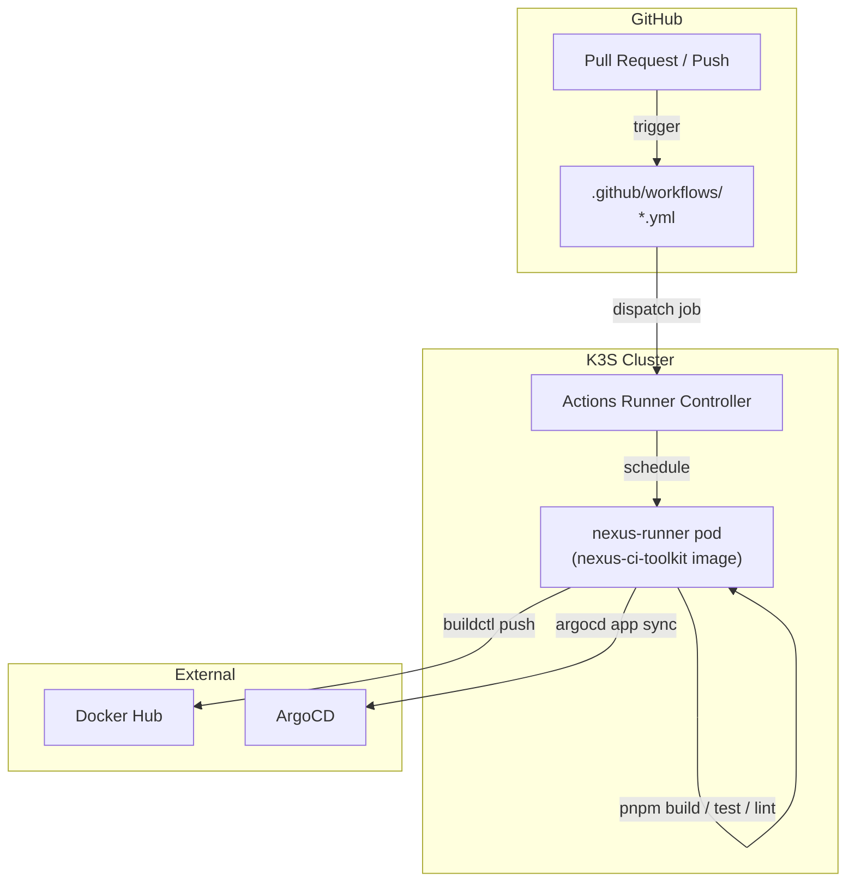
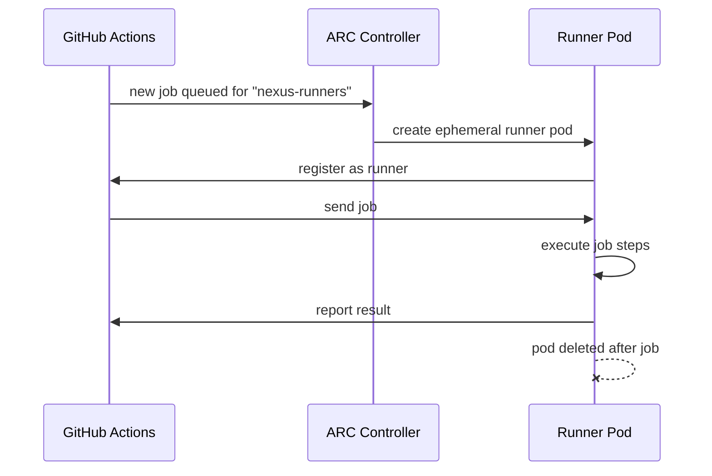
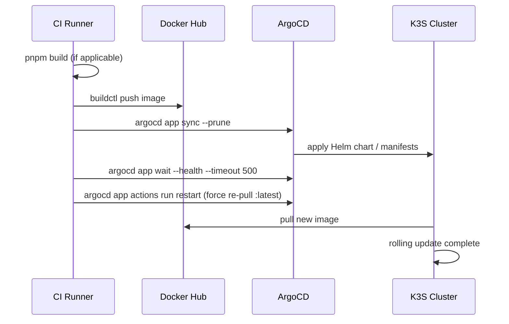

# CI/CD

The CI/CD system is built on **GitHub Actions** with **self-hosted runners** running inside the K3S cluster. This means CI jobs run in the same environment as production, with direct access to cluster tooling.

## Overview



## Workflows

| Workflow                    | Trigger                           | What it does                       |
| --------------------------- | --------------------------------- | ---------------------------------- |
| `checks-pr.yml`             | PR opened/updated                 | Runs type checks                   |
| `test-pr.yml`               | PR opened/updated                 | Runs unit tests                    |
| `lint-and-format-pr.yml`    | PR opened/updated                 | Runs ESLint + Prettier checks      |
| `checks-main.yml`           | Push to main                      | Type checks on main                |
| `test-main.yml`             | Push to main                      | Tests on main                      |
| `lint-and-format-main.yaml` | Push to main                      | Lint on main                       |
| `build-docker-images.yml`   | Push to main / manual             | Builds all Docker images           |
| `deploy-portfolio.yml`      | Called by build workflow          | Builds, pushes, deploys portfolio  |
| `deploy-documentation.yml`  | Called by build workflow / manual | Builds, pushes, deploys docs       |
| `deploy-bastion.yml`        | Manual                            | Deploys bastion via Docker Compose |
| `deploy-vault.yml`          | Manual                            | Deploys Vault via Docker Compose   |

## CI toolkit image

All CI jobs run in a custom Docker image: `kbntx/nexus-ci-toolkit:1.0`

**Source:** `platform/custom-docker-images/nexus-ci-toolkit/Dockerfile`

Pre-installed tools:

| Tool                | Version  | Purpose                        |
| ------------------- | -------- | ------------------------------ |
| Node.js             | 22       | Frontend builds                |
| pnpm                | latest   | Package management             |
| Docker CLI          | latest   | Interacting with Docker daemon |
| kubectl             | v1.32.0  | Cluster operations             |
| ArgoCD CLI          | v2.14.11 | Sync and wait on deployments   |
| GitHub CLI (`gh`)   | latest   | GitHub API interactions        |
| buildctl (BuildKit) | latest   | Rootless Docker image builds   |
| mongodb-tools       | latest   | Database utilities             |
| s5cmd               | latest   | S3-compatible operations       |

## Self-hosted runners

### Why self-hosted?

- Direct access to the cluster's internal network (ArgoCD, internal services)
- No need to expose the cluster API publicly
- Faster builds (persistent pnpm cache, local Docker layer cache)

### How ARC works



Runner pods are ephemeral — created for each job, deleted after completion. The image used is `kbntx/nexus-ci-toolkit:1.0`.

**Controller path:** `platform/github-arc-runners/controller/`
**Runners path:** `platform/github-arc-runners/runners/`

## Image building

Docker images are built with **BuildKit** (`buildctl`) running in rootless mode inside the CI runner. The `buildkit-and-push` composite action handles this:

```yaml
- uses: ./.github/actions/buildkit-and-push
  with:
    context: apps/portfolio # build context directory
    file: apps/portfolio/Dockerfile # path to Dockerfile
    tag: kbntx/portfolio:latest # image tag to push
```

BuildKit is chosen over plain `docker build` because it supports rootless operation, which is required in the containerised runner environment.

## Deploy pipeline

A typical deployment flow for an application:


