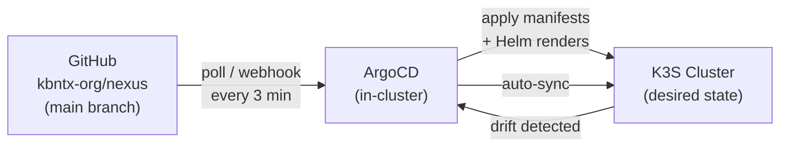
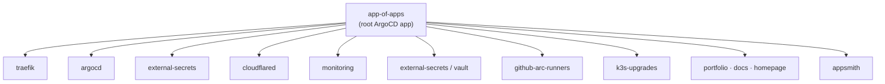

# GitOps

All workloads on the cluster are deployed and managed through **ArgoCD** using a GitOps model. This means the cluster state is always derived from what's in the `main` branch of this repository — no manual `kubectl apply` in production.

## How it works



ArgoCD continuously watches the repository. When a diff is detected between the Git state and the cluster state, it reconciles — applying the change automatically.

## App-of-Apps pattern

Rather than registering each application in ArgoCD manually, a single root application (`app-of-apps`) manages all others. This is the **App-of-Apps** pattern.



The root application is defined in `platform/app-of-apps/` and uses the `argocd-apps` Helm chart. All child applications are declared in `platform/app-of-apps/values.yaml`.

### Adding a new component

To deploy a new component to the cluster:

1. Create your Helm chart or raw manifests under `platform/<component>/`
2. Add an entry in `platform/app-of-apps/values.yaml`:

```yaml
argocd-apps:
  applications:
    my-component:
      project: default
      source:
        repoURL: https://github.com/kbntx-org/nexus.git
        path: platform/my-component
        targetRevision: main
      destination:
        server: https://kubernetes.default.svc
        namespace: my-component
      syncPolicy:
        syncOptions:
          - CreateNamespace=true
```

3. Push to `main` — ArgoCD picks up the change and deploys the new app automatically.

## ArgoCD

ArgoCD itself is deployed as a child application managed by `app-of-apps`, meaning it is also GitOps-managed (self-managing).

The ArgoCD Helm chart lives at `platform/argocd/`. It wraps the upstream ArgoCD Helm chart with custom values.

### Accessing ArgoCD

ArgoCD is exposed at `argocd.kbntx.com` through the Cloudflare tunnel. It is also used in CI/CD workflows via the CLI:

```bash
# Sync an application
argocd app sync portfolio --prune

# Wait for healthy state
argocd app wait portfolio --sync --health --operation --timeout 500

# Restart pods (force re-pull of :latest image)
argocd app actions run portfolio restart \
  --kind Deployment \
  --resource-name portfolio \
  --namespace portfolio
```

## Sync strategy

All applications use **manual sync** by default — they are synced explicitly by CI/CD workflows after a new image is pushed. This prevents accidental rollouts from unrelated Git changes.

The only exception is infrastructure components (ArgoCD, Traefik, monitoring, etc.) which auto-sync since their Helm chart values rarely change without intent.

!!! tip "Pruning"
    The `--prune` flag on `argocd app sync` removes Kubernetes resources that are no longer present in Git. Always use it in CI to keep the cluster clean.
