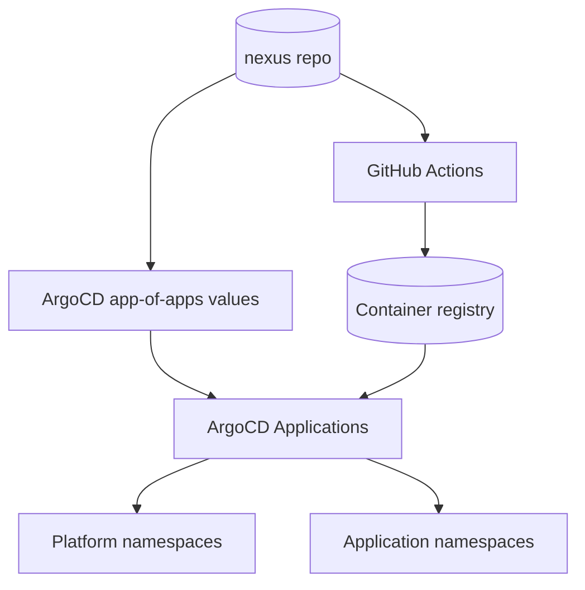

# Platform overview

Nexus is organized around a GitOps-managed Kubernetes platform.

## Control plane model

## Deployed component groups

- **Ingress & traffic**: Traefik, cloudflared, cloudflare ingress controller.
- **Secrets & security**: External Secrets, Vault-related manifests.
- **Observability**: Monitoring stack (Grafana/Prometheus).
- **Cluster operations**: k3s upgrade controller and plans.
- **Applications**: Portfolio, Homepage, Documentation, Appsmith.

See detailed pages in this section for operational boundaries.
