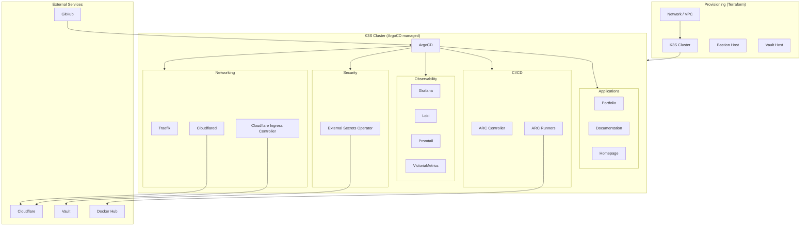

# Platform

The platform layer is everything that makes applications run reliably: infrastructure, networking, secrets, observability, and CI/CD.

## Component map

## Sections

| Section                                   | What it covers                                             |
| ----------------------------------------- | ---------------------------------------------------------- |
| [Infrastructure](infrastructure/index.md) | Hetzner Cloud, Terraform, K3S cluster, networking, bastion |
| [GitOps](gitops/index.md)                 | ArgoCD, App-of-Apps pattern, sync strategy                 |
| [Networking](networking/index.md)         | Traefik, Cloudflare Tunnel, custom Ingress Controller      |
| [Security](security/index.md)             | HashiCorp Vault, External Secrets Operator                 |
| [Observability](observability/index.md)   | Grafana, Loki, Promtail, VictoriaMetrics, Node Exporter    |
| [CI/CD](ci-cd/index.md)                   | GitHub Actions, self-hosted ARC runners, CI toolkit        |
| [Applications](applications/index.md)     | Portfolio, Documentation site, Homepage                    |
