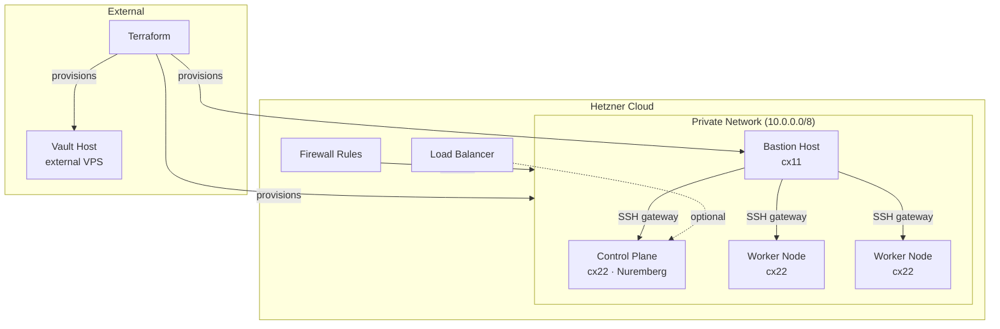

# Infrastructure

The infrastructure layer provisions everything the platform runs on. It is entirely managed with **Terraform** and targets **Hetzner Cloud** as the cloud provider.

## Topology



## Components

| Component | Path | Technology |
|-----------|------|-----------|
| K3S Cluster | `platform/kubernetes/` | Terraform + k3s module |
| Private Network | `platform/network/` | Terraform |
| Bastion Host | `platform/bastion/` | Terraform + Docker Compose |
| HashiCorp Vault | `platform/vault/` | Terraform + Docker Compose |
| Reusable Modules | `platform/terraform-modules/` | Terraform modules |

## Terraform modules

The platform uses three reusable Terraform modules under `platform/terraform-modules/`:

### `k3s`

Creates a K3S cluster with a configurable control plane and node pools on Hetzner Cloud. It handles server creation, K3S installation via cloud-init, and outputs the kubeconfig.

### `firewall`

Creates Hetzner Cloud firewall rules. Used to restrict ingress to only required ports (SSH from bastion, Kubernetes API from allowed CIDRs, etc.).

### `vps`

Provisions a single Hetzner VPS. Used as a building block for the bastion and Vault hosts.

## How to provision

Provisioning is split into independent Terraform workspaces so each layer can be managed separately:

```bash
# 1. Network first (other modules depend on it)
cd platform/network
terraform init && terraform apply

# 2. Kubernetes cluster
cd platform/kubernetes
terraform init && terraform apply

# 3. Bastion (for cluster access)
cd platform/bastion/provision
terraform init && terraform apply

# 4. Vault host
cd platform/vault/provision
terraform init && terraform apply
```

!!! warning "State management"
    Terraform state is not stored in this repository. Ensure you configure a remote backend (e.g., Terraform Cloud, S3) before provisioning shared infrastructure.

## Cluster access

The K3S API server is not exposed to the public internet. Access is routed through the bastion host:

```bash
# SSH tunnel to API server via bastion
ssh -L 6443:<control-plane-ip>:6443 user@<bastion-ip>

# Then use kubectl with the kubeconfig from Terraform output
export KUBECONFIG=./kubeconfig.yaml
kubectl get nodes
```
