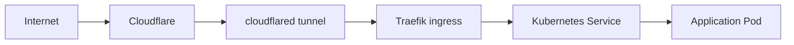

# Kubernetes and networking

This page explains how networking-related components are split in this repository.

## Components in scope

- `platform/traefik`
- `platform/cloudflared`
- `platform/cloudflare-ingress-controller`
- `platform/hetzner-cloud-controller`
- `platform/network`

## Request flow (high level)

## Practical guidance

- Keep ingress hostnames and service names explicit in charts.
- Treat DNS, tunnels, and ingress as one delivery chain when debugging 5xx/404 issues.
- Validate namespace and selectors first before deep network debugging.
