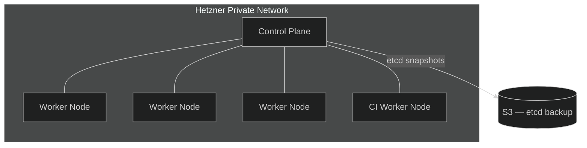

## What We Run

The platform runs on a **K3S** Kubernetes cluster hosted on **Hetzner Cloud**. K3S was chosen over full K8s because it is lightweight, production-ready, and easy to self-manage on small infrastructure without sacrificing any Kubernetes primitives we need.

Everything is provisioned with **Terraform**, split into independent workspaces so each layer can be managed separately.

## Topology

All nodes live on a private Hetzner network. Nothing is directly reachable from the internet.



| Component        | Path                          | Technology                                   |
| ---------------- | ----------------------------- | -------------------------------------------- |
| K3S Cluster      | `platform/kubernetes/`        | Terraform + k3s module                       |
| Private Network  | `platform/network/`           | Terraform                                    |
| Bastion Host     | `platform/bastion/`           | Terraform + Docker Compose                   |
| Vault Host       | `platform/vault/`             | Terraform + Docker Compose                   |
| Reusable Modules | `platform/terraform-modules/` | Terraform modules (`k3s`, `firewall`, `vps`) |

The **CI worker** is a dedicated node with a taint that only ARC runner pods tolerate. This keeps CI workloads physically separated from production workloads.

## Control Plane Backup

K3S stores cluster state in **etcd**. Automatic etcd snapshots are pushed to an S3-compatible bucket on a schedule, so the cluster can be restored from a known-good state after a failure.

The snapshot configuration lives in [`platform/kubernetes/`](https://github.com/kbntx-org/nexus/tree/main/platform/kubernetes).

## Provisioning Order

The Terraform workspaces have dependencies, so they must be applied in order:

```bash
# 1. Network (everything else depends on it)
cd platform/network && terraform apply

# 2. K3S cluster
cd platform/kubernetes && terraform apply

# 3. Bastion (needed for cluster access)
cd platform/bastion/provision && terraform apply

# 4. Vault host
cd platform/vault/provision && terraform apply
```

!!! warning "Terraform state"
State is not stored in this repository. Configure a remote backend before provisioning shared infrastructure.

## Cluster Access

The K3S API server is on the private network — not reachable directly. Access goes through the bastion:

```bash
# Tunnel the API server via bastion
ssh -L 6443:<control-plane-ip>:6443 user@<bastion-ip> -N &

# Then use the kubeconfig from Terraform output
export KUBECONFIG=./kubeconfig.yaml
kubectl get nodes
```

For day-to-day access from your devices without an SSH tunnel, the [Cloudflare WARP + bastion](../networking/01-overview.md#private-traffic) setup routes VPC traffic directly.

## Cluster Upgrades

K3S upgrades are managed automatically by the [system-upgrade-controller](https://github.com/rancher/system-upgrade-controller), configured at [`platform/k3s-upgrades/`](https://github.com/kbntx-org/nexus/tree/main/platform/k3s-upgrades). Upgrade plans are defined as CRDs that the controller picks up and applies.

## References

- [`platform/kubernetes/`](https://github.com/kbntx-org/nexus/tree/main/platform/kubernetes) — cluster Terraform
- [`platform/network/`](https://github.com/kbntx-org/nexus/tree/main/platform/network) — private network Terraform
- [`platform/terraform-modules/`](https://github.com/kbntx-org/nexus/tree/main/platform/terraform-modules) — reusable modules
- [K3S documentation](https://docs.k3s.io/)
- [Hetzner Cloud](https://www.hetzner.com/cloud/)
