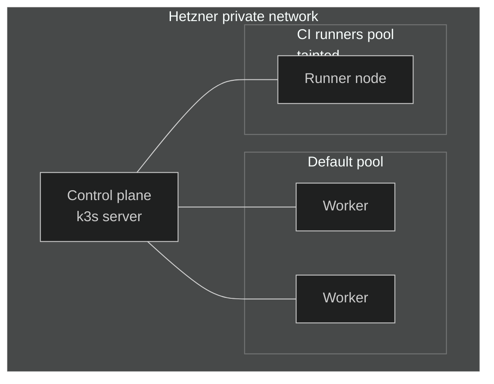

Nexus runs on a [k3s](https://k3s.io/){ target="\_blank" rel="noopener" }
cluster on
[Hetzner Cloud](https://www.hetzner.com/cloud){ target="\_blank" rel="noopener" }
VMs, provisioned end-to-end with
[Terraform](https://developer.hashicorp.com/terraform){ target="\_blank" rel="noopener" }.
A single `terraform apply` from CI brings the whole cluster up: VMs are
created, attached to the private VPC, and bootstrapped into a working
Kubernetes cluster with ArgoCD already running on it.

## Why k3s

A managed control plane is a great default — and a poor fit for a
side-project platform. The hourly bill is non-trivial, and the value
(HA control plane, vendor SLAs) is overkill for a single-tenant cluster
that mostly hosts personal apps.

k3s flips that trade-off:

- **One binary, low memory footprint.** The control plane runs
  comfortably on a small commodity VM, which keeps the baseline cost of
  _just having a cluster_ close to zero.
- **Real Kubernetes.** Same API, same primitives, same ecosystem. There
  is nothing in this repo that would need to change to run on upstream
  Kubernetes — k3s is an implementation detail, not a dialect.
- **Self-managed, but cheap to operate.** No control-plane addons to
  babysit beyond what we explicitly opt into. Bundled niceties (Traefik,
  servicelb, local-path) are _disabled_ on purpose so the cluster looks
  like a vanilla Kubernetes cluster — Traefik comes back in as its own
  GitOps-managed chart, ingress goes through Cloudflare Tunnel, and
  storage is handled by the Hetzner CSI driver.

## Why Hetzner

Hetzner Cloud is the cheapest credible host for the kind of workloads
this platform runs. The price per vCPU and per GB of RAM is hard to beat
without compromising on a real provider with a proper API, and the
European data centres are a bonus for latency from where I work. For a
side investment that has to stay sustainable indefinitely, that pricing
is the difference between "hobby project" and "monthly tax".

## Cluster shape

The cluster has one control-plane node and a set of worker pools sitting
on the same private network. The control plane is intentionally
single-node — k3s supports embedded etcd and HA, but a personal platform
does not need a quorum.

Two worker pools today:

- **Default pool** — runs every application and platform workload.
- **CI runners pool** — tainted so only ARC runner pods schedule on it,
  keeping noisy build jobs from competing with application traffic.
  Covered in detail in the [CI/CD overview](../ci-cd/01-overview.md#dedicated-node-pool).

Pool composition (counts, server types, locations) lives in
[`platform/core/kubernetes/provision/main.tf`](https://github.com/kbntx/nexus/blob/main/platform/core/kubernetes/provision/main.tf){ target="\_blank" rel="noopener" }
— that file is the source of truth, and adding a pool is a matter of
adding a key to its `node_pools` map.

## Provisioning

The Terraform under
[`platform/core/kubernetes/provision/`](https://github.com/kbntx/nexus/blob/main/platform/core/kubernetes/provision/){ target="\_blank" rel="noopener" }
is thin — it composes a reusable
[`k3s` module](https://github.com/kbntx/nexus/tree/main/platform/modules/k3s){ target="\_blank" rel="noopener" }
with the cluster-specific shape (control plane + node pools) and the
firewalls that lock SSH and the API server down to the VPC. The module
itself does the heavy lifting:

1. **VMs** are created in Hetzner Cloud and joined to the
   [main VPC](../networking/01-overview.md#the-hetzner-vpc) through a
   `hcloud_server_network` attachment. A spread placement group keeps
   them on different physical hosts.
2. **k3s is installed via cloud-init.** Each VM boots with a generated
   `user_data` that locks SSH down to a Cloudflare Access SSH CA, then
   runs the official `get.k3s.io` installer in a `runcmd` step:
   - The control plane runs as `server --cluster-init` with
     `--disable-cloud-controller`, `--disable=traefik`,
     `--disable=servicelb`, and `--secrets-encryption`. Anything we
     want to opt into comes from a Helm chart, not from k3s defaults.
   - Workers run as `agent` pointed at the control plane's _private_
     IP, with their pool's labels and taints baked into the install
     flags.
3. **Cluster bootstrap.** Right after k3s is up, the control plane runs
   [`init-core-cluster-dependencies.sh`](https://github.com/kbntx/nexus/blob/main/platform/modules/k3s/config/init-core-cluster-dependencies.sh){ target="\_blank" rel="noopener" },
   shipped onto the node alongside two pre-tarred Helm charts (the
   Hetzner cloud controller and ArgoCD). It installs Helm, waits for
   the API server to be ready, then `helm install`s those two charts.
   That is the whole bootstrap surface — once ArgoCD is alive, every
   other component (Traefik, cloudflared, Vault Agent, the upgrade
   controller, applications) is reconciled by ArgoCD from the same
   monorepo. See [GitOps](../argocd/01-overview.md) for that side.

The result: bringing the cluster up from scratch is one Terraform
workspace away. There is no manual `kubectl apply` step, no SSH ritual,
no out-of-band install of a CI tool to hand-hold the bootstrap.

## Hetzner Cloud Controller Manager

k3s is started with `--disable-cloud-controller` and
`--kubelet-arg="cloud-provider=external"` precisely so the
[Hetzner Cloud Controller Manager](https://github.com/hetznercloud/hcloud-cloud-controller-manager){ target="\_blank" rel="noopener" }
can take its place. It is installed at bootstrap from
[`platform/core/hetzner-cloud-controller/`](https://github.com/kbntx/nexus/tree/main/platform/core/hetzner-cloud-controller){ target="\_blank" rel="noopener" }
and gives the cluster proper integration with the cloud underneath:

- **Node lifecycle.** It populates each Node object with provider info,
  zone/region labels, and the right private IP from the VPC. When a VM
  is deleted in Hetzner, the corresponding Node is cleaned up
  automatically instead of lingering as `NotReady` forever.
- **Network awareness.** With networking enabled, the CCM teaches the
  cluster about the Hetzner private network so pod CIDRs route across
  nodes through the VPC rather than over public IPs.
- **CSI on tap.** The same chart pulls in the
  [Hetzner CSI driver](https://github.com/hetznercloud/csi-driver){ target="\_blank" rel="noopener" },
  so any workload that needs persistent storage gets a real
  `hcloud-volumes` StorageClass without extra wiring.

We do **not** use cluster-side LoadBalancer Services — Cloudflare Tunnel
handles all ingress (see [Networking](../networking/01-overview.md)) —
but the LoadBalancer integration ships with the same chart and is one
Service annotation away if it is ever needed.

## Upgrades

Upgrading k3s on every node by hand would be a non-starter, so the
cluster runs Rancher's
[system-upgrade-controller](https://github.com/rancher/system-upgrade-controller){ target="\_blank" rel="noopener" }.
The controller watches `Plan` CRDs and turns each one into a Job that
drains a node, runs the upgrade image, and uncordons it.

Two plans live in
[`platform/core/kubernetes/upgrades/plans/`](https://github.com/kbntx/nexus/tree/main/platform/core/kubernetes/upgrades/plans){ target="\_blank" rel="noopener" }:
one targets control-plane nodes, the other targets workers, and both
track the upstream **stable** k3s release channel. The agent plan
declares the server plan as a `prepare` step so the control plane is
always upgraded first. Concurrency is set to one — the cluster rolls a
single node at a time, never sacrificing more than one node's worth of
capacity to an upgrade.

The controller itself is packaged as a small chart under
[`platform/core/kubernetes/upgrades/system-upgrade-controller/`](https://github.com/kbntx/nexus/tree/main/platform/core/kubernetes/upgrades/system-upgrade-controller){ target="\_blank" rel="noopener" }
and, like everything post-bootstrap, is reconciled by ArgoCD. Pinning
or skipping a release is a matter of changing the channel (or swapping
to a `version:` field) in the plans and merging — the controller picks
the change up on its next reconcile.

## References

- [`platform/core/kubernetes/provision/`](https://github.com/kbntx/nexus/tree/main/platform/core/kubernetes/provision){ target="\_blank" rel="noopener" } — cluster-shape Terraform (control plane, pools, firewalls)
- [`platform/modules/k3s/`](https://github.com/kbntx/nexus/tree/main/platform/modules/k3s){ target="\_blank" rel="noopener" } — reusable k3s module (cloud-init, server/agent install, bootstrap)
- [`platform/modules/k3s/config/cloud-init.yml`](https://github.com/kbntx/nexus/blob/main/platform/modules/k3s/config/cloud-init.yml){ target="\_blank" rel="noopener" } — the cloud-init that installs k3s on every node
- [`platform/modules/k3s/config/init-core-cluster-dependencies.sh`](https://github.com/kbntx/nexus/blob/main/platform/modules/k3s/config/init-core-cluster-dependencies.sh){ target="\_blank" rel="noopener" } — post-install bootstrap (CCM + ArgoCD)
- [`platform/core/hetzner-cloud-controller/`](https://github.com/kbntx/nexus/tree/main/platform/core/hetzner-cloud-controller){ target="\_blank" rel="noopener" } — Hetzner CCM + CSI Helm chart
- [`platform/core/kubernetes/upgrades/`](https://github.com/kbntx/nexus/tree/main/platform/core/kubernetes/upgrades){ target="\_blank" rel="noopener" } — system-upgrade-controller and the k3s upgrade plans
- [`platform/core/network/`](https://github.com/kbntx/nexus/tree/main/platform/core/network){ target="\_blank" rel="noopener" } — the private VPC the cluster joins
