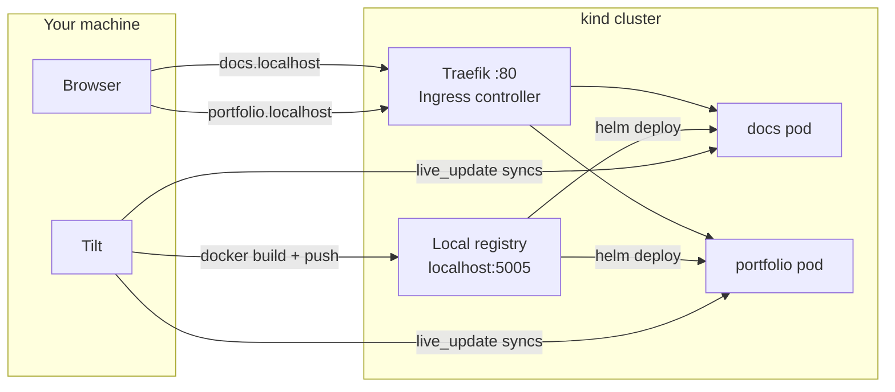

# Local Development

Local development runs the same Helm charts and Docker images used in production, inside a local Kubernetes cluster. This ensures that what works locally will work in production.

The setup is powered by **[Tilt](https://tilt.dev)** — a local dev environment orchestrator — on top of a local **kind** cluster with a Docker registry sidecar, with **Traefik** as the ingress controller.

Services are accessible via `*.localhost` domains (e.g. `http://portfolio.localhost`). Modern OSes resolve any `.localhost` domain to `127.0.0.1`, and Traefik routes requests to the right pod based on the `Host` header.

---

## How it works



Tilt:

1. Builds Docker images from the local source.
2. Pushes them to the local registry (`localhost:5005`), reachable inside the cluster as `kind-registry:5000`.
3. Deploys each service via its Helm chart with `values.local.yaml` overrides.
4. Watches source files and applies **live updates** — syncing changed files directly into the running container without a full rebuild.

---

## Prerequisites

Install these tools before starting:

| Tool | Purpose | Install |
|---|---|---|
| [Docker](https://docs.docker.com/get-docker/) | Container runtime | `brew install --cask docker` |
| [kind](https://kind.sigs.k8s.io/) | Local Kubernetes clusters | `brew install kind` |
| [Tilt](https://tilt.dev) | Local dev orchestrator | `brew install tilt-dev/tap/tilt` |
| [kubectl](https://kubernetes.io/docs/tasks/tools/) | Kubernetes CLI | `brew install kubectl` |
| [Helm](https://helm.sh) | Kubernetes package manager | `brew install helm` |
| [pnpm](https://pnpm.io) | Node package manager | `brew install pnpm` |

---

## First-time setup

**1. Create the local cluster:**

```sh
pnpm cluster:create
```

This runs [`scripts/cluster.sh create`](../../../../scripts/cluster.sh), which:

1. Starts a local Docker registry on port `5005`.
2. Creates a kind cluster named `kind-kind` with containerd configured to mirror `localhost:5005` through the registry container.
3. Connects the registry to the kind Docker network so nodes can pull images by name.
4. Applies a `ConfigMap` in `kube-public` to advertise the registry to tooling.

**2. Install dependencies:**

```sh
pnpm install
```

---

## Starting the local environment

Each service is an opt-in profile. Start only what you need:

```sh
# Documentation site only
pnpm dev:docs

# Portfolio only
pnpm dev:portfolio
```

Tilt opens a browser UI at `http://localhost:10350` where you can see build logs, resource health, and trigger manual rebuilds.

### Available services

| Profile | Command | Local URL |
|---|---|---|
| `docs` | `pnpm dev:docs` | http://docs.localhost |
| `portfolio` | `pnpm dev:portfolio` | http://portfolio.localhost |

> **Traefik** is automatically started as a dependency of both services and forwards port 80.

### Stopping

```sh
pnpm dev:reset
```

This tears down all Tilt-managed resources but leaves the cluster running.

---

## Destroying the cluster

```sh
pnpm cluster:delete
```

---

## How profiles work

The `Tiltfile` reads the `--profile` flag to decide which services to start. Without a profile, all services are enabled. Traefik is always started automatically as a dependency.

```
docs      → [traefik, docs]
portfolio → [traefik, portfolio]
all       → [traefik, docs, portfolio]
```

---

## Live updates

Source file changes are synced directly into running containers without rebuilding the image.

| Service | Watched paths | Action |
|---|---|---|
| docs | `docs/src/`, `docs/mkdocs.yml` | Synced to `/workspace/` |
| portfolio | `apps/portfolio/src/` | Synced to container src |
| portfolio | `apps/portfolio/package.json` | Synced + `pnpm install` runs inside the container |
| portfolio | `tsconfig.base.json` | Synced to container |

A full image rebuild is triggered when `Dockerfile.local`, `pnpm-lock.yaml`, or other non-synced root files change.

---

## Local values overrides

Each service has a `values.local.yaml` that overrides production Helm values:

| File | Key differences from production |
|---|---|
| `docs/helm/values.local.yaml` | `replicas: 1`, `containerPort: 8000`, `ingressHost: docs.localhost` |
| `apps/portfolio/chart/values.local.yaml` | `replicas: 1`, `containerPort: 4200`, health probes disabled, `ingressHost: portfolio.localhost` |

---

## Troubleshooting

**`Kubernetes context 'kind-kind' does not exist`**
Run `pnpm cluster:create` first.

**`http://docs.localhost` or `http://portfolio.localhost` not loading**
Traefik may still be starting. Check `http://localhost:10350` in the Tilt UI. Also confirm port 80 is not already in use (`lsof -i :80`).

**Image build is slow on first run**
Expected — dependencies are installed inside the container. Subsequent builds use Docker layer cache and are much faster.

**Live update not picking up changes**
Check the Tilt UI at `http://localhost:10350` for sync errors. If needed, trigger a manual rebuild from the UI.
