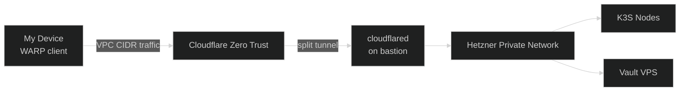

Nexus has two distinct traffic planes: **public** (internet-facing requests to applications) and **private** (my devices talking to the cluster's internal network). Both are handled through Cloudflare — nothing is directly exposed to the internet.

## Public Traffic

The Kubernetes cluster has no public load balancer and no open inbound ports. Public traffic enters through a **Cloudflare Tunnel**.

**How it works:**

1. Cloudflare handles DNS for `kbntx.com` and proxies all requests through the edge (TLS, DDoS protection, WAF included for free)
2. Inside the cluster, a `cloudflared` pod maintains a persistent outbound connection to the Cloudflare network
3. When a request arrives at the Cloudflare edge, it is forwarded down that tunnel to `cloudflared`
4. `cloudflared` forwards it to **Traefik**, the in-cluster ingress controller, which routes to the correct pod by hostname

The [`cloudflare-ingress-controller`](https://github.com/kbntx-org/nexus/tree/main/platform/cloudflare-ingress-controller) (a custom Go controller) keeps the tunnel routing config in sync with Kubernetes `Ingress` resources automatically — no manual Cloudflare dashboard updates needed when deploying a new service.

### Tools with Direct Tunnels

Some tools (like Vault) run outside the cluster in a Docker Compose stack on a separate Hetzner VPS. Those get their own dedicated `cloudflared` tunnel targeting the service directly, rather than going through Traefik.

This keeps the cluster ingress clean and means those services are completely isolated from the cluster's network path.

## Private Traffic

For accessing the cluster's internal network from my own devices — without opening any ports — I use a **Cloudflare WARP + Zero Trust** setup with a bastion host.

**The bastion** is a Hetzner VPS running a single Docker Compose service: a `cloudflared` container connected to a dedicated tunnel. It lives inside the same private Hetzner network as the cluster.

**Split tunneling** is configured in Cloudflare Zero Trust: any traffic from my WARP-connected devices destined for the VPC CIDR is routed through the bastion's `cloudflared` tunnel instead of the regular internet path.

The result: my devices can talk directly to any IP on the Hetzner private network as if they were on the same LAN — with no SSH port forwarding, no VPN server to manage, and nothing exposed to the internet. The bastion is literally just a tunnel.

## References

- [`platform/cloudflared/`](https://github.com/kbntx-org/nexus/tree/main/platform/cloudflared) — cluster tunnel deployment
- [`platform/cloudflare-ingress-controller/`](https://github.com/kbntx-org/nexus/tree/main/platform/cloudflare-ingress-controller) — custom controller syncing Ingress to Cloudflare
- [`platform/bastion/`](https://github.com/kbntx-org/nexus/tree/main/platform/bastion) — bastion host provisioning and tunnel
- [`platform/traefik/`](https://github.com/kbntx-org/nexus/tree/main/platform/traefik) — in-cluster ingress controller
- [Cloudflare Tunnel documentation](https://developers.cloudflare.com/cloudflare-one/connections/connect-networks/)
- [Cloudflare WARP](https://developers.cloudflare.com/cloudflare-one/connections/connect-devices/warp/)
