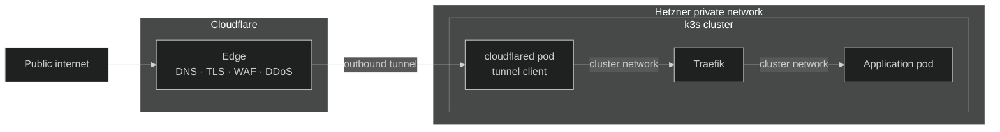
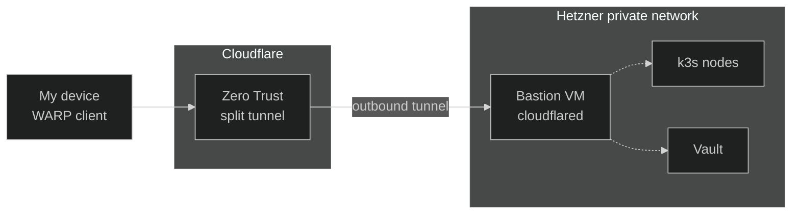

Networking in Nexus is built on one rule: **the cluster has no open
inbound ports.** The nodes do carry public IPs (that is how they reach
the internet for pulls and updates), but the firewall closes every
inbound port — nothing on those IPs is reachable from the outside.
Everything in front of the cluster is
[Cloudflare](https://www.cloudflare.com/){ target="\_blank" rel="noopener" };
everything behind it is a private
[Hetzner](https://www.hetzner.com/cloud){ target="\_blank" rel="noopener" }
network. Traffic only ever reaches the cluster through outbound tunnels
that the cluster itself opens.

That single decision pushes a lot of value: no load-balancer cost, a
massively reduced attack surface, and the option to layer Cloudflare's
edge features (TLS, WAF, DDoS protection, geo-routing, Zero Trust) for
free.

## The layers

From the outside in, a request crosses four distinct network layers
before it reaches an application pod:

1. **Cloudflare edge.** Cloudflare owns the DNS for the apex domain and
   proxies every request. TLS terminates here; the edge also provides
   the WAF, DDoS shield, and rate limiting. The cluster's origin IP is
   never exposed.
2. **[Cloudflare Tunnel](https://developers.cloudflare.com/cloudflare-one/connections/connect-networks/){ target="\_blank" rel="noopener" }.**
   In-cluster
   [`cloudflared`](https://github.com/cloudflare/cloudflared){ target="\_blank" rel="noopener" }
   pods hold a persistent **outbound** connection to the Cloudflare edge.
   Requests are pushed back down that connection — there is no inbound
   listener on the cluster side, no firewall hole to manage, and no
   public IP needed. Multiple replicas + a PodDisruptionBudget keep the
   tunnel live during pod churn.
3. **[Traefik](https://doc.traefik.io/traefik/){ target="\_blank" rel="noopener" }.**
   `cloudflared` forwards the unwrapped request to Traefik over the
   internal cluster network. Traefik does the in-cluster routing — host
   and path matching, middlewares, observability — to the right
   application service. Details of the Traefik configuration live in
   the [Traefik](../traefik/01-overview.md) section; for networking
   purposes it is just one more hop.
4. **Application pod.** The actual workload. Same cluster network as
   Traefik, no special exposure.

## The Hetzner VPC

The cluster nodes and the bastion live inside a private
[Hetzner Cloud network](https://docs.hetzner.com/cloud/networks/overview){ target="\_blank" rel="noopener" },
provisioned with
[Terraform](https://developer.hashicorp.com/terraform){ target="\_blank" rel="noopener" }
in
[`platform/core/network/`](https://github.com/kbntx/nexus/tree/main/platform/core/network){ target="\_blank" rel="noopener" }.
Public traffic never enters this network — the only ingress path is the
Cloudflare Tunnel above, which is purely outbound from the cluster's
point of view.

The VPC is also what gives the bastion a route to the cluster's private
network without a single packet of inbound traffic from the internet.

## Private access via WARP

Operating the platform — `kubectl`, ArgoCD CLI, Vault, internal
dashboards — needs reachability into the VPC, but punching SSH or VPN
ports into the internet would defeat the no-public-ingress rule.
Cloudflare's
[WARP](https://developers.cloudflare.com/cloudflare-one/connections/connect-devices/warp/){ target="\_blank" rel="noopener" }
client + Zero Trust split tunnel solves this with the same outbound-only
pattern as public traffic.

A bastion VM sits inside the VPC running nothing but a `cloudflared`
container connected to a dedicated tunnel. Cloudflare Zero Trust is
configured to **route any traffic from a WARP-connected device toward
the VPC subnet through that bastion tunnel**. The result: my laptop can
reach any private IP in the VPC as if it were on the same LAN — no SSH
port forwarding, no VPN server to manage, nothing exposed publicly.

The bastion itself is provisioned alongside the rest of the
infrastructure ([`platform/core/bastion/`](https://github.com/kbntx/nexus/tree/main/platform/core/bastion){ target="\_blank" rel="noopener" })
and runs the tunnel client through a tiny Docker Compose stack.

## Two tunnels, two purposes

Both flows above use the same underlying mechanism — a Cloudflare Tunnel
opened by an outbound-only `cloudflared` process — but they serve very
different purposes and stay separate:

| Tunnel             | Where `cloudflared` runs    | What it carries                                        |
| ------------------ | --------------------------- | ------------------------------------------------------ |
| **Public tunnel**  | Pods inside the k3s cluster | Internet traffic to public apps, via Traefik           |
| **Private tunnel** | The bastion VM in the VPC   | WARP-routed traffic from my devices to private VPC IPs |

Keeping them separate means the public path stays narrow and predictable
(only Traefik-routed app traffic), while the private path can target raw
VPC IPs without ever touching the cluster ingress.

## References

- [`platform/core/network/`](https://github.com/kbntx/nexus/tree/main/platform/core/network){ target="\_blank" rel="noopener" } — Hetzner VPC + subnet (Terraform)
- [`platform/core/cloudflared/`](https://github.com/kbntx/nexus/tree/main/platform/core/cloudflared){ target="\_blank" rel="noopener" } — in-cluster `cloudflared` Deployment + PDB for the public tunnel
- [`platform/core/traefik/`](https://github.com/kbntx/nexus/tree/main/platform/core/traefik){ target="\_blank" rel="noopener" } — in-cluster ingress controller
- [`platform/core/bastion/`](https://github.com/kbntx/nexus/tree/main/platform/core/bastion){ target="\_blank" rel="noopener" } — bastion VM + private tunnel
