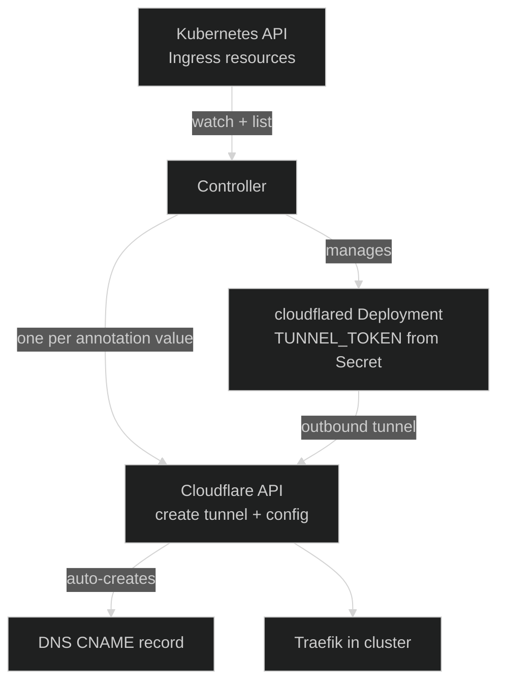

The `cloudflare-ingress-controller` is a custom Go controller that owns the full lifecycle of Cloudflare Tunnels for the cluster. It reads a `cloudflare.io/tunnel: <name>` annotation on Kubernetes `Ingress` resources, and automatically provisions — and tears down — everything needed to route traffic: the Cloudflare Tunnel, DNS records, and the `cloudflared` Deployment.

## Why a custom controller?

Cloudflare provides no official Kubernetes controller for managing tunnel routing. This controller fills that gap, going further than just config sync: it manages the entire tunnel lifecycle (create, configure, delete) as well as the in-cluster `cloudflared` pod, all driven by Ingress annotations.

## How it works



On each reconcile cycle the controller:

1. **Lists** all `Ingress` resources (filtered by `ingressClassName` if configured)
2. **Groups** hostnames by `cloudflare.io/tunnel` annotation value — one group per unique tunnel name
3. **Detects collisions**: a hostname claimed by more than one tunnel is logged as an error and skipped
4. **Orphan cleanup**: any Cloudflare Tunnel whose prefixed name is not referenced by any Ingress is deleted along with its Secret, Deployment, and PDB
5. **Reconciles each tunnel group**:
   - Creates a remotely-managed Cloudflare Tunnel and stores its token in a `Secret` (first time only)
   - Syncs ingress rules via the Cloudflare API (DNS records are created automatically)
   - Ensures a `cloudflared` Deployment exists and reads `TUNNEL_TOKEN` from the Secret
   - Ensures a `PodDisruptionBudget` with `minAvailable: 1` exists

A Kubernetes watch keeps the controller reactive to changes; a periodic ticker catches any drift if the watch drops.

## Tunnel naming and scoping

All tunnels managed by this controller are prefixed with a configurable string (default: `k8s`). A tunnel named `kenny` in an annotation becomes `k8s-kenny` in Cloudflare. The controller only considers tunnels whose names match this prefix — manually created tunnels are never touched.

## Annotation

```yaml
metadata:
  annotations:
    cloudflare.io/tunnel: kenny   # → creates/manages CF tunnel "k8s-kenny"
```

Multiple Ingresses can share the same annotation value and will be merged into a single tunnel and `cloudflared` Deployment.

## Package layout

| Path | Responsibility |
|------|----------------|
| [`cmd/main.go`](https://github.com/kbntx-org/nexus/tree/main/platform/cloudflare-ingress-controller/cmd/main.go) | Entry point — wiring, leader election, reconciliation loop |
| [`internal/k8s/k8s.go`](https://github.com/kbntx-org/nexus/tree/main/platform/cloudflare-ingress-controller/internal/k8s/k8s.go) | Kubernetes lister/watcher + Secret/Deployment/PDB management |
| [`internal/cloudflare/cloudflare.go`](https://github.com/kbntx-org/nexus/tree/main/platform/cloudflare-ingress-controller/internal/cloudflare/cloudflare.go) | Cloudflare SDK client (tunnel lifecycle + ingress config) |
| [`internal/controller/controller.go`](https://github.com/kbntx-org/nexus/tree/main/platform/cloudflare-ingress-controller/internal/controller/controller.go) | Pure reconciliation logic — no I/O, fully unit-tested |

The reconciliation logic is intentionally pure (no I/O) so it can be tested without a real cluster or Cloudflare account. All side effects are injected through the `k8s.Service` and `cloudflare.Service` interfaces.

## Configuration

The controller is configured entirely via environment variables, injected by the Helm chart:

| Variable | Source | Purpose |
|----------|--------|---------|
| `TARGET_SERVICE_URL` | `values.yaml` | Backend URL all hostnames forward to (Traefik's cluster-internal address) |
| `INGRESS_CLASS_NAME` | `values.yaml` | Only process `Ingress` objects with this class; empty = watch all |
| `RECONCILE_INTERVAL_MS` | `values.yaml` | How often to force a full reconcile, in addition to watch events |
| `CF_TUNNEL_NAME_PREFIX` | `values.yaml` | Prefix for all managed tunnel names (default: `k8s`) |
| `CLOUDFLARED_IMAGE` | `values.yaml` | Image used for cloudflared Deployments |
| `CLOUDFLARED_REPLICAS` | `values.yaml` | Replica count per cloudflared Deployment |
| `CF_API_TOKEN` | secret via `extraEnv` | Cloudflare API token with tunnel write access |
| `CF_ACCOUNT_ID` | secret via `extraEnv` | Cloudflare account ID |
| `CF_ZONE_ID` | secret via `extraEnv` | Reserved for future DNS operations |

Cloudflare credentials are never baked into `values.yaml`; they are injected using the `extraEnv` list with `secretKeyRef` entries. See [`helm/values.yaml`](https://github.com/kbntx-org/nexus/tree/main/platform/cloudflare-ingress-controller/helm/values.yaml) for the full example.

## Logging

The controller emits structured JSON logs to stdout via Go's `slog` package. Key log events:

- `starting cloudflare-ingress-controller` — startup with resolved config
- `waiting for leadership` / `became leader` — leader election transitions
- `creating cloudflare tunnel` / `tunnel created` — new tunnel provisioned
- `updating tunnel ingress rules` / `tunnel config updated` — routing rules changed
- `tunnel config is up to date, nothing to do` — no diff detected
- `deleting orphan tunnel` — prefixed tunnel with no matching Ingress removed
- `hostname claimed by multiple tunnels — skipping` — collision detected

## Local development

Start the controller locally with:

```sh
tilt up --profile=cloudflare-ingress-controller
```

The [`helm/values.local.yaml`](https://github.com/kbntx-org/nexus/tree/main/platform/cloudflare-ingress-controller/helm/values.local.yaml) file sets a faster reconcile interval. Cloudflare credentials default to `placeholder` in a `.env` file — replace them with real values if you need the controller to actually sync with Cloudflare.

## References

- [`platform/cloudflare-ingress-controller/`](https://github.com/kbntx-org/nexus/tree/main/platform/cloudflare-ingress-controller) — full source
- [Cloudflare Tunnel API](https://developers.cloudflare.com/api/resources/zero_trust/subresources/tunnels/subresources/configurations/)
- [cloudflare-go SDK](https://github.com/cloudflare/cloudflare-go)
