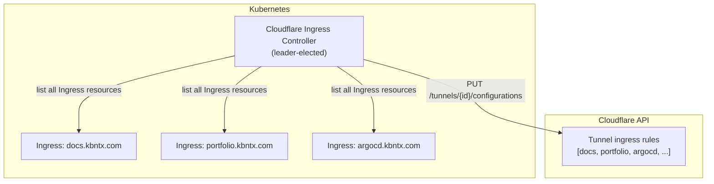
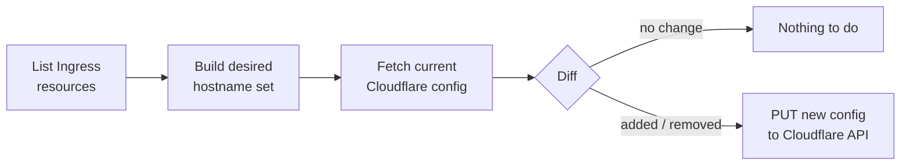
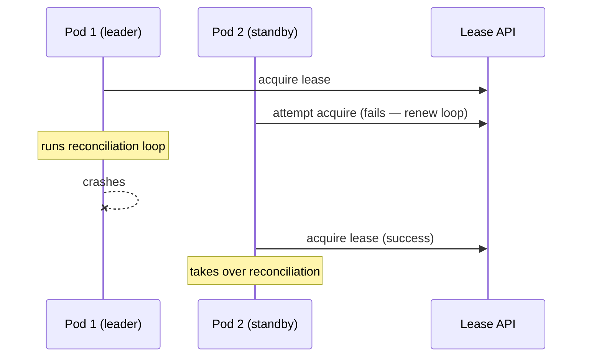

# Cloudflare Ingress Controller

The Cloudflare Ingress Controller is a **custom Kubernetes controller** written in TypeScript. It bridges the gap between Kubernetes `Ingress` resources and the Cloudflare Tunnel configuration — so you don't have to manually add hostnames to Cloudflare whenever you deploy a new service.

**Source:** `platform/cloudflare-ingress-controller/src/`

## Problem it solves

When you create a Kubernetes `Ingress` with `host: my-app.kbntx.com`, Traefik knows to route traffic for that hostname. But Cloudflare still needs to be told that `my-app.kbntx.com` should be forwarded through the tunnel. Without this controller, that would be a manual step.

## How it works



### Reconciliation loop

Every 30 seconds (configurable via `RECONCILE_INTERVAL_MS`), and on every `Ingress` watch event, the controller:

1. **Lists** all `Ingress` resources in the cluster (optionally filtered by `ingressClassName`)
2. **Computes** the desired set of hostnames
3. **Fetches** the current Cloudflare tunnel configuration
4. **Diffs** desired vs current
5. **Applies** a PUT to the Cloudflare API with the full updated rule set



### Leader election

The controller uses the Kubernetes `Lease` API for leader election, so multiple replicas can run safely — only the leader performs reconciliation. If the leader pod dies, another replica takes over within seconds.



## Configuration

| Environment variable | Required | Description |
|---------------------|----------|-------------|
| `TARGET_SERVICE_URL` | Yes | URL that all tunnel ingress rules point to (Traefik's internal address) |
| `CF_API_TOKEN` | Yes | Cloudflare API token with tunnel write access |
| `CF_ACCOUNT_ID` | Yes | Cloudflare account ID |
| `CF_TUNNEL_ID` | Yes | ID of the Cloudflare Tunnel to manage |
| `CF_ZONE_ID` | Yes | Cloudflare zone ID (reserved for future DNS operations) |
| `POD_NAME` | Yes | Injected via Downward API — used for leader election identity |
| `POD_NAMESPACE` | Yes | Injected via Downward API — namespace for the Lease lock |
| `INGRESS_CLASS_NAME` | No | Filter Ingress resources by class name (watches all if unset) |
| `RECONCILE_INTERVAL_MS` | No | Reconciliation interval in ms (default: `30000`) |

All sensitive values (`CF_API_TOKEN`, etc.) are injected via the External Secrets Operator.

## Development

```bash
cd platform/cloudflare-ingress-controller

# Install dependencies
pnpm install

# Run tests
pnpm test

# Build
pnpm build
```

The Docker image is built by the `build-docker-images` workflow and pushed to Docker Hub.
