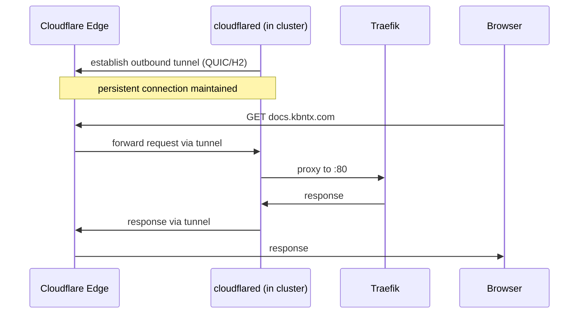

# Cloudflared

`cloudflared` is the Cloudflare Tunnel daemon. It runs inside the cluster and maintains a persistent, outbound-only connection to Cloudflare's edge network. All internet traffic destined for `*.kbntx.com` enters the cluster through this tunnel.

## Why a tunnel?

| Traditional ingress                 | Cloudflare Tunnel                       |
| ----------------------------------- | --------------------------------------- |
| Public IP + firewall rules required | No public IP needed                     |
| DDoS mitigation at perimeter        | DDoS protection built in via Cloudflare |
| TLS certs managed in cluster        | TLS terminated at Cloudflare edge       |
| Open inbound ports                  | No inbound ports — fully outbound       |

## How it works

## Configuration

`cloudflared` is deployed from `platform/cloudflared/`. The tunnel ID and credentials are injected via the External Secrets Operator — they never appear in Git.

The tunnel routing rules (which hostname maps to which internal service) are managed by the **Cloudflare Ingress Controller**, not by `cloudflared` directly. `cloudflared` just forwards everything to Traefik; the hostname-based routing happens at Traefik.
