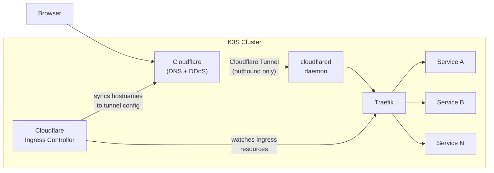

# Networking

Nexus uses a layered networking model. Traffic from the internet reaches the cluster through Cloudflare, is tunnelled into the cluster via a **Cloudflare Tunnel**, and is then routed to services by **Traefik**.

## Traffic flow

No inbound firewall ports need to be opened. The tunnel is fully outbound, which means the cluster is never directly reachable from the internet.

## Components

| Component                                                         | Path                                      | Role                                         |
| ----------------------------------------------------------------- | ----------------------------------------- | -------------------------------------------- |
| [Traefik](traefik.md)                                             | `platform/traefik/`                       | In-cluster ingress controller                |
| [cloudflared](cloudflared.md)                                     | `platform/cloudflared/`                   | Cloudflare Tunnel daemon                     |
| [Cloudflare Ingress Controller](cloudflare-ingress-controller.md) | `platform/cloudflare-ingress-controller/` | Syncs K8s Ingress → Cloudflare tunnel config |
