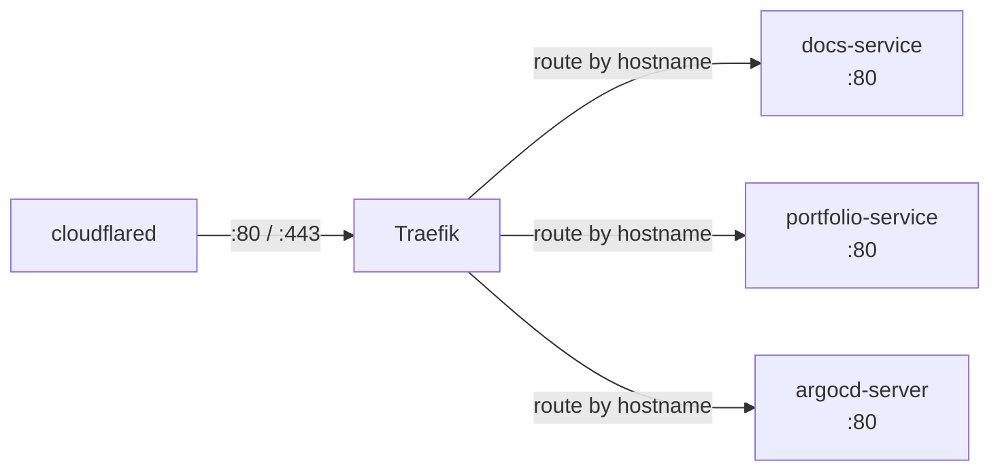

# Traefik

Traefik is the in-cluster ingress controller. It receives traffic from `cloudflared` and routes it to the correct Kubernetes service based on the hostname defined in `Ingress` resources.

## Role in the platform



## Configuration

Traefik is deployed via its upstream Helm chart, configured in `platform/traefik/values.yaml`. Key customisations:

- Deployed in the `traefik-ingress` namespace
- Watches `Ingress` resources across all namespaces
- Listens on port 80 (TLS is terminated at Cloudflare, not in the cluster)

## Adding a new route

To expose a service, create a standard Kubernetes `Ingress` in the relevant namespace:

```yaml
apiVersion: networking.k8s.io/v1
kind: Ingress
metadata:
  name: my-app-ingress
  namespace: my-app
spec:
  rules:
    - host: my-app.kbntx.com
      http:
        paths:
          - path: /
            pathType: Prefix
            backend:
              service:
                name: my-app-service
                port:
                  number: 80
```

Once the `Ingress` is applied, the Cloudflare Ingress Controller picks up the hostname and adds it to the Cloudflare Tunnel configuration automatically.
