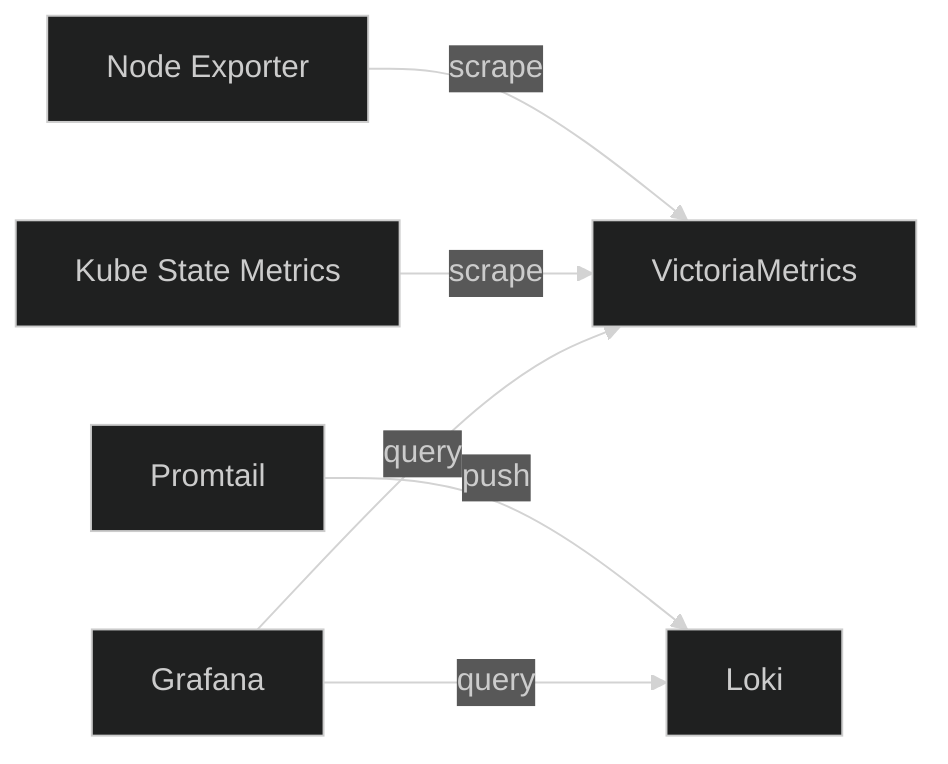

## Stack

The monitoring stack provides metrics, logs, and dashboards for the cluster and all workloads. Every component is deployed as part of a single Helm chart at [`platform/services/monitoring/`](https://github.com/kbntx-org/nexus/tree/main/platform/services/monitoring).

| Component              | Role                                                             |
| ---------------------- | ---------------------------------------------------------------- |
| **VictoriaMetrics**    | Prometheus-compatible time-series database — stores all metrics  |
| **Grafana**            | Dashboards and the primary observability UI                      |
| **Loki**               | Log aggregation backend                                          |
| **Promtail**           | Log shipper — runs as a DaemonSet, collects all pod logs         |
| **Node Exporter**      | Host-level metrics (CPU, memory, disk, network)                  |
| **Kube State Metrics** | Kubernetes object state as metrics (pod status, replica counts…) |

## How It Fits Together

VictoriaMetrics scrapes metrics from Node Exporter and Kube State Metrics on a schedule. Promtail tails container logs from each node and pushes them to Loki. Grafana queries both stores.

## Grafana

Grafana is exposed at `grafana.kbntx.com`. Credentials are managed via Vault and injected by the External Secrets Operator.

Its persistent storage (dashboards, data sources, alert rules) uses a **PostgreSQL** backend deployed alongside it in the monitoring chart — more reliable than the default SQLite.

Some useful dashboards available out of the box:

- **Kubernetes / Cluster** — node resource usage
- **Kubernetes / Workloads** — pod CPU/memory per namespace
- **Node Exporter Full** — detailed host metrics
- **Logs** — explore logs across all namespaces via LogQL

## Log Storage

Loki uses **S3-compatible object storage** for log chunks. This keeps log retention independent of cluster storage capacity. The bucket credentials are injected from Vault via ESO.

## Adding Application Metrics

Any application that exposes a `/metrics` endpoint in Prometheus format can be scraped. Add a scrape target in `platform/services/monitoring/values.yaml` or use a `ServiceMonitor` if the monitoring chart supports it.

## References

- [`platform/services/monitoring/`](https://github.com/kbntx-org/nexus/tree/main/platform/services/monitoring) — full stack Helm chart
- [Grafana documentation](https://grafana.com/docs/)
- [VictoriaMetrics documentation](https://docs.victoriametrics.com/)
- [Loki documentation](https://grafana.com/docs/loki/latest/)
