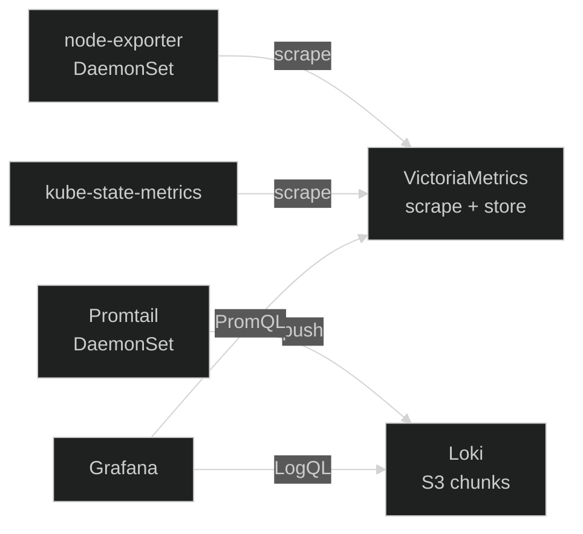

Observability in Nexus is a single Helm chart at
[`platform/services/monitoring/`](https://github.com/kbntx/nexus/tree/main/platform/services/monitoring){ target="\_blank" rel="noopener" }
that wires up metrics, logs, and a UI for both. The deliberate split is:
**[VictoriaMetrics](https://docs.victoriametrics.com/){ target="\_blank" rel="noopener" }**
for metrics,
**[Loki](https://grafana.com/docs/loki/latest/){ target="\_blank" rel="noopener" }**
for logs, and
**[Grafana](https://grafana.com/docs/grafana/latest/){ target="\_blank" rel="noopener" }**
in front of both.

## Why VictoriaMetrics instead of Prometheus

Prometheus is the obvious choice and the reference implementation; this
stack swaps it out for VictoriaMetrics on purpose:

- **Memory footprint.** At equivalent active-series counts,
  VictoriaMetrics keeps a much smaller resident set than Prometheus.
  On a single-node-ish home cluster where every gigabyte of RAM is
  visible on the bill, that gap matters.
- **Single binary, single process.** No separate scraper, ruler, or
  remote-write target to operate. The
  [`victoria-metrics-single`](https://github.com/VictoriaMetrics/helm-charts/tree/master/charts/victoria-metrics-single){ target="\_blank" rel="noopener" }
  chart deploys one workload that scrapes, stores, and serves queries.
- **Drop-in PromQL.** Existing Prometheus dashboards, exporters, scrape
  configs, and PromQL queries all work unchanged. VictoriaMetrics speaks
  Prometheus' remote-write and query APIs, so the rest of the ecosystem
  (`kube-state-metrics`, `node-exporter`, Grafana data sources) does not
  even know it has been swapped out.

The trade-off is mostly cultural: the Prometheus operator's CRDs
(`ServiceMonitor`, `PodMonitor`, `PrometheusRule`) are not used here.
Scrape targets are defined as plain Prometheus scrape configs in
[`values.yaml`](https://github.com/kbntx/nexus/blob/main/platform/services/monitoring/values.yaml){ target="\_blank" rel="noopener" }
under `victoria-metrics-single.server.scrape.extraScrapeConfigs`.

## Metrics pipeline

Two exporters publish metrics that VictoriaMetrics scrapes on a schedule:

- [`prometheus-node-exporter`](https://github.com/prometheus/node_exporter){ target="\_blank" rel="noopener" }
  (DaemonSet) for host-level signals — CPU, memory, disk, network.
- [`kube-state-metrics`](https://github.com/kubernetes/kube-state-metrics){ target="\_blank" rel="noopener" }
  for the Kubernetes object graph as metrics — pod phases, replica
  counts, deployment status, and so on.

Both are subcharts of the monitoring chart, discovered via Kubernetes
SD, and filtered down by `relabel_configs` so VictoriaMetrics only
keeps the targets it cares about.

## Logs pipeline

[Promtail](https://grafana.com/docs/loki/latest/clients/promtail/){ target="\_blank" rel="noopener" }
runs as a DaemonSet on every node, tails container log files from the
node's filesystem, attaches Kubernetes metadata (namespace, pod,
controller kind, controller name), and pushes batches into Loki's HTTP
ingest endpoint.

Loki itself runs in
[**SimpleScalable**](https://grafana.com/docs/loki/latest/get-started/deployment-modes/#simple-scalable){ target="\_blank" rel="noopener" }
mode — `read`, `write`, and `backend` workloads scaled separately —
backed by **S3-compatible object storage** for chunks and the index.
Bucket credentials and endpoint come from Vault via the External
Secrets Operator (see [Secrets](../secrets/01-overview.md)). Keeping
chunks off cluster volumes means log retention scales with object
storage pricing rather than with the cluster's PVC budget, and
snapshots / lifecycle rules live where they belong: at the bucket.

## How it fits together

## Grafana behind Cloudflare Zero Trust

Grafana is published through the in-cluster Ingress
([`ingress.yaml`](https://github.com/kbntx/nexus/blob/main/platform/services/monitoring/templates/ingress.yaml){ target="\_blank" rel="noopener" }),
which means the same Cloudflare Tunnel + Zero Trust front door
described in [Networking](../networking/01-overview.md) gates access.
Authentication, MFA, and identity-aware policy all live at the edge.

The Grafana config takes that for granted: the values file flips
`auth.disable_login: true` and `auth.disable_login_form: true`, so
the application itself has no login screen at all. If you reached
Grafana, Cloudflare already decided you should be there. The only
local credential is the admin password, pulled from Vault via ESO and
mounted from the
[`monitoring-secret`](https://github.com/kbntx/nexus/blob/main/platform/services/monitoring/templates/secrets.yaml){ target="\_blank" rel="noopener" }.

## Postgres for Grafana state

Grafana keeps dashboards, data sources, alert rules, and users in a
relational store. The chart default is embedded SQLite on a PVC, which
is fine until it isn't:

- **Single-writer, file-locked.** Crash mid-write and the file can come
  back corrupted. Recovering from a snapshot of an in-flight SQLite
  database is its own adventure.
- **Tied to a pod.** The PVC pins Grafana to a single replica and a
  single node — fine for one user, awkward for any HA story later.
- **Snapshot-unfriendly.** Volume snapshots of a live SQLite file are
  not consistent without quiescing the pod first.

The chart instead deploys a small dedicated
[Postgres](https://www.postgresql.org/docs/){ target="\_blank" rel="noopener" }
StatefulSet
([`postgres.yaml`](https://github.com/kbntx/nexus/blob/main/platform/services/monitoring/templates/postgres.yaml){ target="\_blank" rel="noopener" })
on a Hetzner block volume, and points Grafana at it via
`grafana.ini.database`. Credentials are injected from the same Vault
secret as the rest of the stack. Grafana itself runs with
`persistence.enabled: false` — all state lives in Postgres, the pod is
disposable, and backups are a single `pg_dump` (or a volume snapshot of
a quiesced Postgres) away.

## Adding a dashboard

Two paths, both supported:

- **Imported through the UI.** The Grafana sidecar runs with
  `allowUiUpdates: true`, so dashboards saved interactively are
  persisted to Postgres and survive pod restarts. Good for iterating.
- **Provisioned via the chart.** Anything that should be source-of-truth
  belongs in the
  [monitoring values file](https://github.com/kbntx/nexus/blob/main/platform/services/monitoring/values.yaml){ target="\_blank" rel="noopener" }
  (or a sibling ConfigMap rendered by the chart) so it is reapplied on
  every ArgoCD sync. UI-edited dashboards should eventually be
  promoted there.

## Alerts

Alerting is currently a **known gap**. The Loki subchart has
`ruler.enabled: false`, no `PrometheusRule`-equivalents are wired into
VictoriaMetrics, and no Alertmanager (or
[`vmalert`](https://docs.victoriametrics.com/vmalert/){ target="\_blank" rel="noopener" })
is deployed. Dashboards exist; pages do not. Wiring `vmalert` against
VictoriaMetrics for metric alerts and re-enabling the Loki ruler for
log-based alerts is the natural next step, but until then alerting is
explicitly out of scope for this stack.

## References

- [`platform/services/monitoring/`](https://github.com/kbntx/nexus/tree/main/platform/services/monitoring){ target="\_blank" rel="noopener" } — full monitoring Helm chart
- [`platform/services/monitoring/Chart.yaml`](https://github.com/kbntx/nexus/blob/main/platform/services/monitoring/Chart.yaml){ target="\_blank" rel="noopener" } — subchart dependencies (VictoriaMetrics, Grafana, Loki, Promtail, kube-state-metrics, node-exporter)
- [`platform/services/monitoring/values.yaml`](https://github.com/kbntx/nexus/blob/main/platform/services/monitoring/values.yaml){ target="\_blank" rel="noopener" } — scrape configs, Loki S3 backend, Grafana database + auth
- [`platform/services/monitoring/templates/ingress.yaml`](https://github.com/kbntx/nexus/blob/main/platform/services/monitoring/templates/ingress.yaml){ target="\_blank" rel="noopener" } — Grafana Ingress
- [`platform/services/monitoring/templates/postgres.yaml`](https://github.com/kbntx/nexus/blob/main/platform/services/monitoring/templates/postgres.yaml){ target="\_blank" rel="noopener" } — dedicated Postgres for Grafana state
- [`platform/services/monitoring/templates/secrets.yaml`](https://github.com/kbntx/nexus/blob/main/platform/services/monitoring/templates/secrets.yaml){ target="\_blank" rel="noopener" } — Vault-backed `ExternalSecret` for credentials
