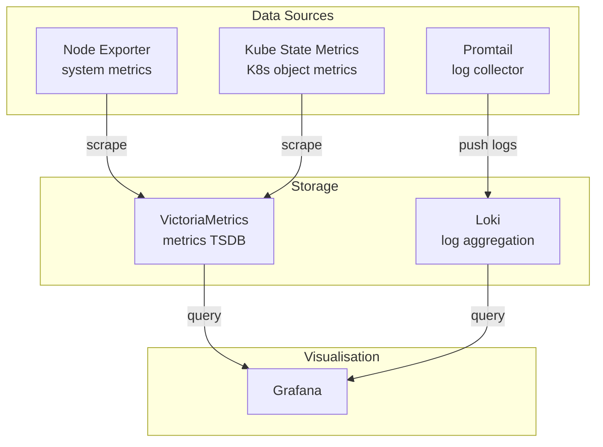
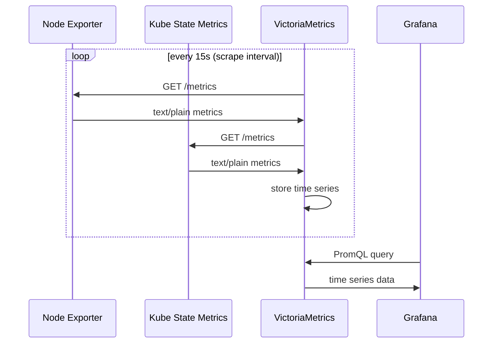
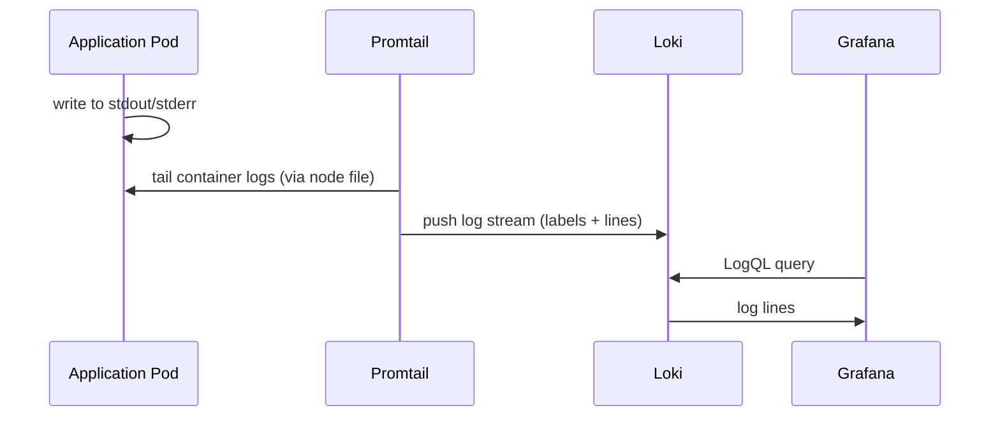

# Observability

The monitoring stack provides metrics, logs, and dashboards for the entire cluster and its workloads. It is deployed as a single Helm chart at `platform/monitoring/` that bundles all components.

## Stack overview

## Components

| Component              | Version | Role                                                    |
| ---------------------- | ------- | ------------------------------------------------------- |
| **Grafana**            | 10.5.8  | Dashboards and alerting UI                              |
| **VictoriaMetrics**    | 0.24.6  | Prometheus-compatible time-series database              |
| **Loki**               | 6.40.0  | Log aggregation                                         |
| **Promtail**           | 6.17.1  | Log shipping agent (runs as DaemonSet)                  |
| **Kube State Metrics** | 6.4.2   | Exposes K8s object state as Prometheus metrics          |
| **Node Exporter**      | 4.48.0  | Exposes host-level metrics (CPU, memory, disk, network) |

All are deployed via their upstream Helm charts, composed in `platform/monitoring/Chart.yaml` as dependencies.

## Metrics flow

## Log flow

Promtail runs as a `DaemonSet` — one instance per node — and automatically discovers all pods, tagging logs with namespace, pod name, and container name.

## Accessing Grafana

Grafana is exposed at `grafana.kbntx.com`. Default credentials are managed via Vault + ESO.

Useful dashboards available out of the box:

- **Kubernetes / Cluster** — node resource usage
- **Kubernetes / Workloads** — pod CPU/memory per namespace
- **Loki / Logs** — explore logs across all namespaces
- **Node Exporter Full** — detailed host metrics

## Adding custom metrics

Any application that exposes a `/metrics` endpoint in Prometheus format can be scraped by VictoriaMetrics. Add a `ServiceMonitor` or configure scrape targets in `platform/monitoring/values.yaml`.
