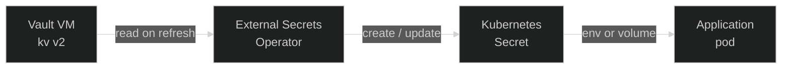

Secrets in Nexus follow one rule: **the cluster never owns the source of
truth.** No secret value is committed to Git, and no secret value lives
exclusively inside the cluster. The credentials, tokens, and connection
strings every workload needs are kept in
[HashiCorp Vault](https://developer.hashicorp.com/vault){ target="\_blank" rel="noopener" }
running on a separate VM, and the cluster reaches in for them through the
[External Secrets Operator](https://external-secrets.io/){ target="\_blank" rel="noopener" }.
What lives in Git is a declarative description of _which_ secret a
workload needs; the value itself is materialised at runtime by the
operator.

That split — store outside, materialise inside — is what lets the
cluster be treated as cattle. It can be torn down and rebuilt without
losing a single credential, and a fresh cluster comes back up by simply
re-reading from Vault.

## Why Vault sits outside the cluster

The hardest secret to bootstrap is the cluster's own credentials. If
Vault lived inside k3s, recovering from a cluster loss would mean
recovering the secret store _from the very secrets the secret store is
supposed to provide_ — a chicken-and-egg problem with no clean answer.

Putting Vault on its own VM removes the cycle:

- The cluster can be destroyed and rebuilt — wholesale or piecewise —
  without touching the secret store.
- A rebuilt cluster reaches Vault the same way it always did and refills
  itself with no manual key entry.
- The blast radius of a cluster compromise stops at the cluster: nothing
  that runs there has ambient access to Vault's storage.

Operator access to Vault uses the same private path as the rest of the
platform — the bastion + WARP setup described in
[Networking](../networking/01-overview.md). There is no separate VPN or
SSH endpoint to manage.

## The Vault VM

Vault is provisioned with
[Terraform](https://developer.hashicorp.com/terraform){ target="\_blank" rel="noopener" }
in
[`platform/core/vault/provision/`](https://github.com/kbntx/nexus/tree/main/platform/core/vault/provision){ target="\_blank" rel="noopener" }
— a single Hetzner VM joined to the same private VPC as the cluster
nodes, fronted by a firewall that only admits SSH from inside the VPC.
The VM has no inbound internet exposure of its own.

The workload on the VM is a small
[Docker Compose](https://docs.docker.com/compose/){ target="\_blank" rel="noopener" }
stack
([`platform/core/vault/deploy/`](https://github.com/kbntx/nexus/tree/main/platform/core/vault/deploy){ target="\_blank" rel="noopener" })
with three containers:

| Container     | Role                                                                                                                                                                                                                                               |
| ------------- | -------------------------------------------------------------------------------------------------------------------------------------------------------------------------------------------------------------------------------------------------- |
| `vault`       | The Vault server itself, configured by [`config.hcl`](https://github.com/kbntx/nexus/blob/main/platform/core/vault/deploy/config/config.hcl){ target="\_blank" rel="noopener" }                                                                    |
| `postgres`    | [PostgreSQL](https://www.postgresql.org/){ target="\_blank" rel="noopener" } storage backend, initialised from [`vault.sql`](https://github.com/kbntx/nexus/blob/main/platform/core/vault/deploy/sql/vault.sql){ target="\_blank" rel="noopener" } |
| `cloudflared` | Outbound Cloudflare Tunnel that publishes the Vault API at a public hostname without opening any inbound port                                                                                                                                      |

### Why a separate Postgres for storage

Vault supports several storage backends; this stack uses Postgres
deliberately rather than the embedded file or integrated-storage (Raft)
options:

- **Durability story matches the rest of the platform.** Postgres is
  already a known quantity here — backups, point-in-time recovery, and
  monitoring are all things the rest of the stack already does for
  databases. Reusing those tools beats adopting a Vault-specific
  snapshotting workflow.
- **Storage and compute upgrade independently.** The Vault binary can be
  rebuilt or rolled forward without touching the data volume, and
  Postgres can be upgraded without rewriting Vault state.
- **Schema is trivially understood.** The backend is a single
  key/value-style table — there is no opaque on-disk format, which makes
  inspection and disaster recovery much more straightforward than with
  a black-box embedded store.

The Vault listener itself runs plain HTTP inside the VM. TLS is
terminated at the Cloudflare edge in front of the tunnel — the same
pattern the cluster uses for public app traffic.

### First-time initialisation

Vault is sealed on first boot and after every restart. Initialising and
unsealing is a one-time operator task done over the bastion path; the
unseal keys and root token produced by `vault operator init` are stored
out-of-band (password manager) and never re-emitted by Vault. There is
no auto-unseal configured on this stack — manual unseal after a restart
is the deliberate trade-off for keeping the keys off the VM.

## External Secrets Operator

In-cluster, the
[External Secrets Operator](https://external-secrets.io/){ target="\_blank" rel="noopener" }
(installed from
[`platform/core/external-secrets/`](https://github.com/kbntx/nexus/tree/main/platform/core/external-secrets){ target="\_blank" rel="noopener" })
reconciles two CRDs:

- **`SecretStore` / `ClusterSecretStore`** — describes _how_ to talk to
  Vault: address, auth method, KV mount.
- **`ExternalSecret`** — describes _what_ to fetch from Vault and what
  Kubernetes `Secret` to materialise from it.

Reconciliation is straightforward: ESO authenticates to Vault, reads the
referenced KV path, and writes (or refreshes) a native Kubernetes
`Secret` in the consuming namespace. Workloads then mount that `Secret`
the way they would any other — env vars, projected volumes, image pull
secrets — without ever knowing Vault is in the picture.

### How ESO authenticates to Vault

Authentication uses Vault's
[Kubernetes auth method](https://developer.hashicorp.com/vault/docs/auth/kubernetes){ target="\_blank" rel="noopener" }:
each consuming app has its own `ServiceAccount`, and ESO presents that
SA's projected token (audience `vault`) to Vault as proof of identity.
Vault validates the token by calling back to the cluster's TokenReview
API — which is why
[`platform/core/external-secrets/templates/rbac.yaml`](https://github.com/kbntx/nexus/blob/main/platform/core/external-secrets/templates/rbac.yaml){ target="\_blank" rel="noopener" }
binds `system:auth-delegator` to the `external-secrets` ServiceAccount
and pins a long-lived token Secret it can use.

Vault then maps the validated SA to a **role** (one per consumer:
`cloudflare`, `monitoring`, `github-arc-runners`, …), and the role's
policy decides which KV paths that consumer is allowed to read. A
compromised app pod can only read its own slice of Vault — it has no
broad credential to extract.

## Adding a new secret

The end-to-end flow for a new secret has three steps:

1. **Write the value into Vault.** Pick or create a KV path under the
   `platform/` mount that matches the consumer's Vault role
   (e.g. `platform/my-app`), then `vault kv put` the value.
2. **Create a `SecretStore` (or reuse a `ClusterSecretStore`) in the
   consumer's chart** that points at the Vault server, the right
   Kubernetes auth role, and a `ServiceAccount` whose token Vault will
   accept. The existing app charts under
   [`platform/core/`](https://github.com/kbntx/nexus/tree/main/platform/core){ target="\_blank" rel="noopener" }
   and
   [`platform/services/`](https://github.com/kbntx/nexus/tree/main/platform/services){ target="\_blank" rel="noopener" }
   ship templates for this — copy the closest one rather than writing
   it from scratch.
3. **Declare an `ExternalSecret`** that references that store and the
   KV path, and consume the resulting `Secret` from the workload's
   manifest. ESO does the rest on its refresh interval; nothing further
   is needed in Git.

For ESO field-level details (refresh intervals, templating, data
extraction), the
[ESO docs](https://external-secrets.io/latest/){ target="\_blank" rel="noopener" }
are the authoritative reference — there is no Nexus-specific wrapper
around them.

## Backups and disaster recovery

Vault's durability today rests on two things: the Postgres volume on
the VM, and the unseal keys/root token kept out-of-band. There is no
automated backup of the Postgres volume in
[`platform/core/vault/deploy/`](https://github.com/kbntx/nexus/tree/main/platform/core/vault/deploy){ target="\_blank" rel="noopener" }
at the moment — that is a known gap, not a deliberate omission. A
periodic logical dump shipped off the VM is the obvious next step and
will land in the deploy stack rather than in this doc.

In the meantime, the recovery story is: the VM itself can be re-imaged
from Terraform, the Compose stack is fully declarative and rebuilds in
one command, and Vault state lives entirely in the Postgres volume — so
preserving (or restoring) that volume is sufficient to bring Vault back
to its last known state, after which the unseal keys complete the
recovery.

## References

- [`platform/core/vault/provision/`](https://github.com/kbntx/nexus/tree/main/platform/core/vault/provision){ target="\_blank" rel="noopener" } — Terraform for the Vault VM, VPC attachment, and firewall
- [`platform/core/vault/deploy/`](https://github.com/kbntx/nexus/tree/main/platform/core/vault/deploy){ target="\_blank" rel="noopener" } — Compose stack, Dockerfiles, and Vault config
- [`platform/core/vault/deploy/config/config.hcl`](https://github.com/kbntx/nexus/blob/main/platform/core/vault/deploy/config/config.hcl){ target="\_blank" rel="noopener" } — listener, storage backend, telemetry
- [`platform/core/vault/deploy/sql/vault.sql`](https://github.com/kbntx/nexus/blob/main/platform/core/vault/deploy/sql/vault.sql){ target="\_blank" rel="noopener" } — Postgres schema for Vault's storage backend
- [`platform/core/external-secrets/`](https://github.com/kbntx/nexus/tree/main/platform/core/external-secrets){ target="\_blank" rel="noopener" } — ESO Helm chart and TokenReview RBAC
- [`platform/core/cloudflared/templates/secrets.yaml`](https://github.com/kbntx/nexus/blob/main/platform/core/cloudflared/templates/secrets.yaml){ target="\_blank" rel="noopener" } — canonical `SecretStore` + `ExternalSecret` example to copy from
