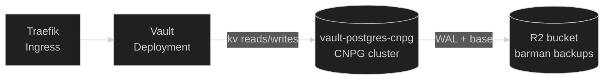
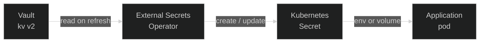

Secrets in Nexus follow one rule: **the cluster never owns the source of
truth.** No secret value is committed to Git, and no secret value lives
exclusively inside an application's Kubernetes manifest. The credentials,
tokens, and connection strings every workload needs are kept in
[HashiCorp Vault](https://developer.hashicorp.com/vault){ target="\_blank" rel="noopener" },
and the cluster reaches in for them through the
[External Secrets Operator](https://external-secrets.io/){ target="\_blank" rel="noopener" }.
What lives in Git is a declarative description of _which_ secret a
workload needs; the value itself is materialised at runtime by the
operator.

That split — store centrally, materialise per-workload — is what lets
the cluster be treated as cattle. Application namespaces can be torn
down and rebuilt without losing a single credential, and a fresh
namespace comes back up by simply re-reading from Vault.

## Vault in the cluster

Vault runs in-cluster as a Helm chart at
[`platform/core/vault/server/`](https://github.com/kbntx-org/nexus/tree/main/platform/core/vault/server){ target="\_blank" rel="noopener" }.
The chart owns three things: the Vault Deployment itself, a
[CloudNativePG](https://cloudnative-pg.io/){ target="\_blank" rel="noopener" }
`Cluster` for storage, and the in-cluster `Ingress` that fronts the API.

### Why Postgres for storage

Vault supports several storage backends; this stack uses Postgres
deliberately rather than the embedded file or integrated-storage (Raft)
options:

- **Durability story matches the rest of the platform.** Postgres is
  already a known quantity here — backups, point-in-time recovery, and
  monitoring are all things CloudNativePG already does for the other
  databases in the cluster. Reusing those tools beats adopting a
  Vault-specific snapshotting workflow.
- **Storage and compute upgrade independently.** The Vault binary can be
  rolled forward without touching the data volume, and Postgres can be
  upgraded without rewriting Vault state.
- **Schema is trivially understood.** The backend is a single
  key/value-style table — there is no opaque on-disk format, which makes
  inspection and disaster recovery much more straightforward than with
  a black-box embedded store.

The schema is bootstrapped on first init by CNPG's
`postInitApplicationSQLRefs`, which reads
[`vault.sql`](https://github.com/kbntx-org/nexus/blob/main/platform/core/vault/server/files/vault.sql){ target="\_blank" rel="noopener" }
out of the `vault-postgres-init` ConfigMap and runs it against the
freshly-created `vault` database. That step only fires the first time
the cluster bootstraps; recovered or re-attached volumes skip it.

### The bootstrap secret

There is exactly one secret that does not come from Vault itself: a
Kubernetes `Secret` named `vault-secret` in the `vault` namespace,
applied manually by the operator. It carries everything Vault needs
before it can serve its first request:

- the Postgres connection URI used by the Vault config,
- the CNPG cluster's superuser username/password,
- the R2 access key and secret used by barman for backups.

This is the chicken-and-egg of running the secret store in-cluster,
contained: every other credential in the cluster is reconciled from
Vault, but Vault's own database connection has to exist before Vault
can come up. Keeping it to a single, well-known secret (rather than the
old VM-scoped Vault stack) is the deliberate trade-off — it loses some
isolation but keeps the recovery story to a single `kubectl apply`.

### Config rendering and sealing

The Vault Deployment runs an init container that `envsubst`s the
Postgres connection URI from `vault-secret` into
[`config.hcl`](https://github.com/kbntx-org/nexus/blob/main/platform/core/vault/server/templates/vault-config.yaml){ target="\_blank" rel="noopener" }
before the main container starts. The rendered config lives in an
`emptyDir`, so the URI never lands on disk and is re-resolved on every
restart.

Vault is sealed on first boot and after every restart. Initialising and
unsealing is a one-time operator task; the unseal keys and root token
produced by `vault operator init` are stored out-of-band (password
manager) and never re-emitted by Vault. There is no auto-unseal
configured — manual unseal after a restart is the deliberate trade-off
for keeping the keys off the cluster.

### Local development

In dev mode (`values.local.yaml` sets `dev: true`), the chart drops the
CNPG cluster and the config-init container entirely and runs Vault with
its built-in `-dev` flag against an in-memory backend. A seed init
container — defined in
[`seed-script.yaml`](https://github.com/kbntx-org/nexus/blob/main/platform/core/vault/server/templates/seed-script.yaml){ target="\_blank" rel="noopener" }
— pre-enables Kubernetes auth, the `admin` policy and role, and the
`dev` KV mount, so a freshly-up local cluster has a working Vault
without any operator steps.

## External Secrets Operator

In-cluster, the
External Secrets Operator
(installed from
[`platform/core/external-secrets/`](https://github.com/kbntx-org/nexus/tree/main/platform/core/external-secrets){ target="\_blank" rel="noopener" })
reconciles two CRDs:

- **`SecretStore` / `ClusterSecretStore`** — describes _how_ to talk to
  Vault: address, auth method, KV mount.
- **`ExternalSecret`** — describes _what_ to fetch from Vault and what
  Kubernetes `Secret` to materialise from it.

Reconciliation is straightforward: ESO authenticates to Vault, reads the
referenced KV path, and writes (or refreshes) a native Kubernetes
`Secret` in the consuming namespace. Workloads then mount that `Secret`
the way they would any other — env vars, projected volumes, image pull
secrets — without ever knowing Vault is in the picture.

### How ESO authenticates to Vault

Authentication uses Vault's
[Kubernetes auth method](https://developer.hashicorp.com/vault/docs/auth/kubernetes){ target="\_blank" rel="noopener" }:
each consuming app has its own `ServiceAccount`, and ESO presents that
SA's projected token (audience `vault`) to Vault as proof of identity.
Vault validates the token by calling back to the cluster's TokenReview
API — which is why
[`platform/core/external-secrets/templates/rbac.yaml`](https://github.com/kbntx-org/nexus/blob/main/platform/core/external-secrets/templates/rbac.yaml){ target="\_blank" rel="noopener" }
binds `system:auth-delegator` to the `external-secrets` ServiceAccount
and pins a long-lived token Secret it can use.

Vault then maps the validated SA to a **role** (one per consumer:
`cloudflare`, `monitoring`, `github-arc-runners`, …), and the role's
policy decides which KV paths that consumer is allowed to read. A
compromised app pod can only read its own slice of Vault — it has no
broad credential to extract.

## Adding a new secret

The end-to-end flow for a new secret has three steps:

1. **Write the value into Vault.** Pick or create a KV path under the
   `platform/` mount that matches the consumer's Vault role
   (e.g. `platform/my-app`), then `vault kv put` the value.
2. **Create a `SecretStore` (or reuse a `ClusterSecretStore`) in the
   consumer's chart** that points at the Vault server, the right
   Kubernetes auth role, and a `ServiceAccount` whose token Vault will
   accept. The existing app charts under
   [`platform/core/`](https://github.com/kbntx-org/nexus/tree/main/platform/core){ target="\_blank" rel="noopener" }
   and
   [`platform/services/`](https://github.com/kbntx-org/nexus/tree/main/platform/services){ target="\_blank" rel="noopener" }
   ship templates for this — copy the closest one rather than writing
   it from scratch.
3. **Declare an `ExternalSecret`** that references that store and the
   KV path, and consume the resulting `Secret` from the workload's
   manifest. ESO does the rest on its refresh interval; nothing further
   is needed in Git.

For ESO field-level details (refresh intervals, templating, data
extraction), the
[ESO docs](https://external-secrets.io/latest/){ target="\_blank" rel="noopener" }
are the authoritative reference — there is no Nexus-specific wrapper
around them.

## Backups and disaster recovery

Vault's durability rests on two things: the CNPG Postgres cluster
backing its KV store, and the unseal keys/root token kept out-of-band.

The Postgres cluster is backed up by CNPG's
[barman integration](https://cloudnative-pg.io/documentation/current/backup_recovery/){ target="\_blank" rel="noopener" }
— full base backups plus continuous WAL shipping to an R2 bucket, on
a daily `ScheduledBackup` and the same retention policy as the other
in-cluster databases. The barman credentials and destination bucket are
configured on the `Cluster` resource in
[`postgres-cnpg.yaml`](https://github.com/kbntx-org/nexus/blob/main/platform/core/vault/server/templates/postgres-cnpg.yaml){ target="\_blank" rel="noopener" }.

Recovery is a two-step story: restore the CNPG cluster from its backup
(point-in-time if needed), then re-apply `vault-secret` and unseal Vault
manually. Nothing in Git needs to change for either step — both the
chart and the schema bootstrap are idempotent against an existing data
volume.

## References

- [`platform/core/vault/server/`](https://github.com/kbntx-org/nexus/tree/main/platform/core/vault/server){ target="\_blank" rel="noopener" } — Vault Helm chart (Deployment, CNPG cluster, Ingress, dev seed)
- [`platform/core/vault/server/templates/postgres-cnpg.yaml`](https://github.com/kbntx-org/nexus/blob/main/platform/core/vault/server/templates/postgres-cnpg.yaml){ target="\_blank" rel="noopener" } — CNPG `Cluster` and `ScheduledBackup` for Vault's storage
- [`platform/core/vault/server/templates/vault-config.yaml`](https://github.com/kbntx-org/nexus/blob/main/platform/core/vault/server/templates/vault-config.yaml){ target="\_blank" rel="noopener" } — Vault listener, storage backend, telemetry
- [`platform/core/vault/server/files/vault.sql`](https://github.com/kbntx-org/nexus/blob/main/platform/core/vault/server/files/vault.sql){ target="\_blank" rel="noopener" } — Postgres schema for Vault's storage backend
- [`platform/core/external-secrets/`](https://github.com/kbntx-org/nexus/tree/main/platform/core/external-secrets){ target="\_blank" rel="noopener" } — ESO Helm chart and TokenReview RBAC
- [`platform/core/cloudflared/templates/secrets.yaml`](https://github.com/kbntx-org/nexus/blob/main/platform/core/cloudflared/templates/secrets.yaml){ target="\_blank" rel="noopener" } — canonical `SecretStore` + `ExternalSecret` example to copy from
