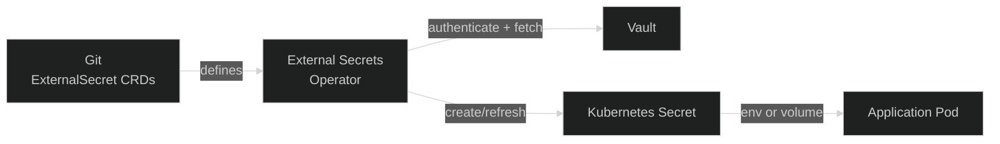

## The Pattern

No secrets are stored in Git. The secret management pattern has two components working together:

- **HashiCorp Vault** — the source of truth for all secrets, running outside the cluster
- **External Secrets Operator (ESO)** — the bridge that pulls secrets from Vault and creates native Kubernetes `Secret` objects



The `ExternalSecret` CRD lives in Git (it only describes _which_ secret to fetch, not the value itself), while Vault holds the actual credentials.

## HashiCorp Vault

Vault runs on a **dedicated VPS** — not inside the K3S cluster. This is intentional: if the cluster is compromised, the secret store remains isolated.

It uses **PostgreSQL as the storage backend** for durability, and is deployed via Docker Compose at `platform/core/vault/deploy/`.

### First-Time Setup

Vault requires a one-time initialisation. SSH into the Vault VPS and run:

```bash
cd deploy && docker compose up -d

# Init — outputs unseal keys and root token (store these securely, they are shown only once)
docker exec vault vault operator init

# Unseal (run 3 times with different keys)
docker exec vault vault operator unseal
```

!!! danger "Unseal keys"
The unseal keys and root token are shown **only once**. Store them in a password manager immediately. Without them you cannot access Vault after a restart.

### Secret Organisation

Secrets are stored under the `kv` secrets engine, organised by component:

```
secret/
├── cloudflare/    # tunnel token, API token
├── github/        # ARC runner token
├── monitoring/    # Grafana credentials
└── ...
```

## External Secrets Operator

ESO watches `ExternalSecret` resources and creates Kubernetes `Secret` objects from Vault data. The operator authenticates to Vault using **AppRole** over HTTPS.

### Adding a Secret

1. **Add the value to Vault:**

   ```bash
   vault kv put secret/my-app api_key=<value>
   ```

2. **Create an `ExternalSecret` in your namespace:**

   ```yaml
   apiVersion: external-secrets.io/v1beta1
   kind: ExternalSecret
   metadata:
     name: my-app-secret
     namespace: my-app
   spec:
     refreshInterval: 1h
     secretStoreRef:
       name: vault-backend
       kind: ClusterSecretStore
     target:
       name: my-app-secret
     data:
       - secretKey: API_KEY
         remoteRef:
           key: secret/my-app
           property: api_key
   ```

3. **Reference it in your Deployment** as you would any Kubernetes Secret.

### Secret Rotation

ESO re-fetches from Vault on the `refreshInterval` (default: 1h) and updates the Kubernetes Secret automatically. Pods that consume secrets as environment variables need a restart to pick up the new value; secrets mounted as volumes are updated in place.

!!! tip "Force an immediate refresh"
Add the annotation `force-sync: <any-value>` to an `ExternalSecret` to trigger a refresh outside the normal schedule.

## References

- [`platform/core/vault/`](https://github.com/kbntx-org/nexus/tree/main/platform/core/vault) — Vault provisioning and Docker Compose deployment
- [`platform/core/external-secrets/`](https://github.com/kbntx-org/nexus/tree/main/platform/core/external-secrets) — ESO Helm chart
- [HashiCorp Vault documentation](https://developer.hashicorp.com/vault)
- [External Secrets Operator documentation](https://external-secrets.io/)
