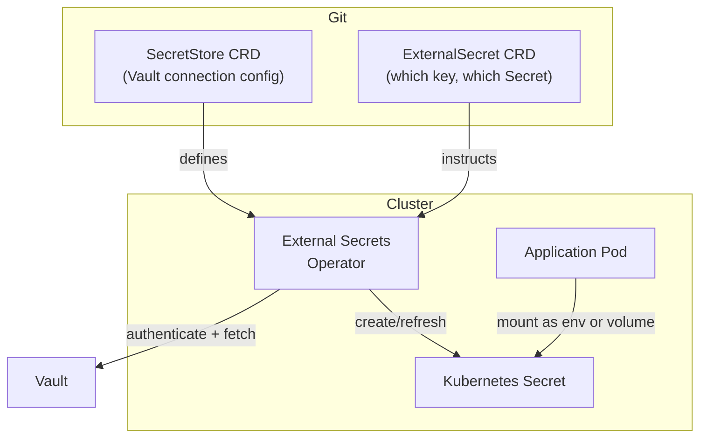

# External Secrets Operator

The External Secrets Operator (ESO) is the bridge between Vault and Kubernetes. It watches `ExternalSecret` custom resources and creates/updates native Kubernetes `Secret` objects from Vault data.

## How it fits



## Key concepts

**`SecretStore`** — Defines how to connect to Vault (address, auth method, namespace). One per namespace, or use a `ClusterSecretStore` for cluster-wide access.

**`ExternalSecret`** — Declares which Vault path to read and which Kubernetes `Secret` to create. The operator reconciles this on a schedule (default: 1h).

## Example

```yaml
apiVersion: external-secrets.io/v1beta1
kind: ExternalSecret
metadata:
  name: cloudflare-credentials
  namespace: cloudflare
spec:
  refreshInterval: 1h
  secretStoreRef:
    name: vault-backend
    kind: ClusterSecretStore
  target:
    name: cloudflare-credentials # name of the K8s Secret to create
  data:
    - secretKey: CF_API_TOKEN
      remoteRef:
        key: secret/cloudflare
        property: api_token
    - secretKey: CF_TUNNEL_ID
      remoteRef:
        key: secret/cloudflare
        property: tunnel_id
```

The resulting `cloudflare-credentials` Secret can then be referenced in a `Deployment` like any other Kubernetes Secret.

## Refresh and rotation

ESO periodically re-fetches from Vault and updates the Kubernetes Secret. Applications that mount secrets as environment variables need a pod restart to pick up rotated values. Secrets mounted as volumes are updated in place.

!!! tip "Force refresh"
Annotate the `ExternalSecret` with `force-sync: <timestamp>` to trigger an immediate refresh outside the normal schedule.
