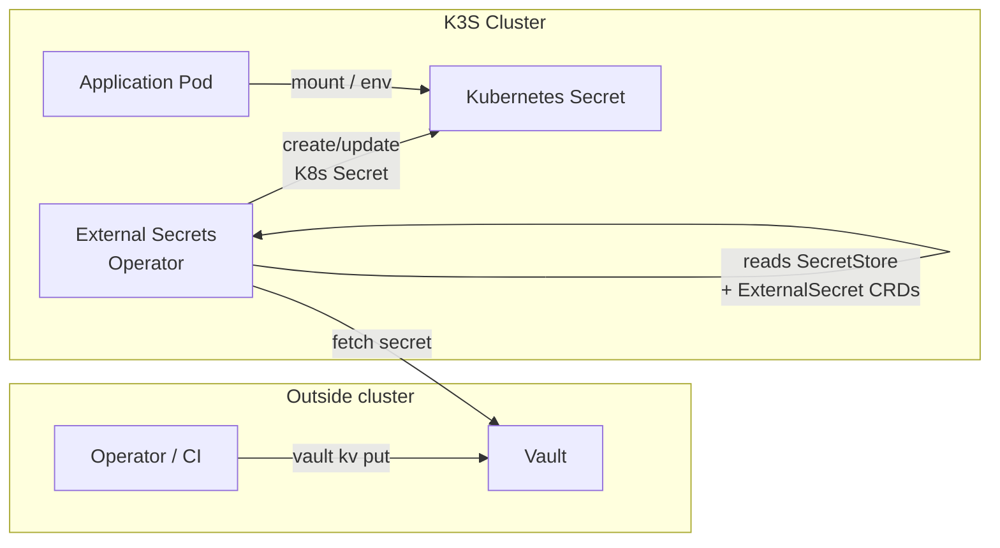

# Security

Secrets management in Nexus follows a strict principle: **no secrets in Git, ever**. Secrets live in HashiCorp Vault and are synchronised into Kubernetes at runtime by the External Secrets Operator.

## Secret lifecycle

No application ever talks to Vault directly. The External Secrets Operator is the only component with Vault credentials.

## Components

| Component                                        | Path                         | Role                            |
| ------------------------------------------------ | ---------------------------- | ------------------------------- |
| [HashiCorp Vault](vault.md)                      | `platform/vault/`            | Source of truth for all secrets |
| [External Secrets Operator](external-secrets.md) | `platform/external-secrets/` | Syncs Vault secrets into K8s    |
