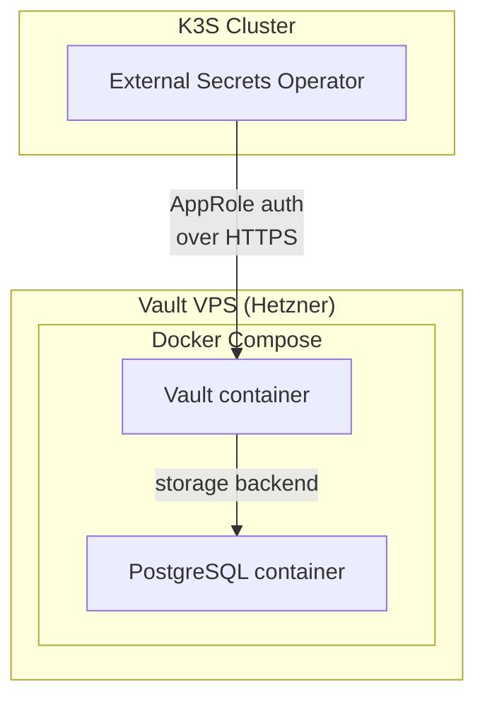

# HashiCorp Vault

Vault is the centralised secret store for the entire platform. It runs on a dedicated VPS (not in the K3S cluster) for isolation, deployed via Docker Compose.

## Deployment



**Location:** `platform/vault/`

```
vault/
├── provision/    # Terraform: provision the Vault VPS
└── deploy/       # Docker Compose: run Vault + PostgreSQL
    ├── docker-compose.yml
    ├── Dockerfile.vault
    └── Dockerfile.postgresql
```

PostgreSQL is used as the storage backend (instead of the default file backend) for durability and easier backup.

## Initialisation

Vault requires an initialisation step on first deployment:

```bash
# SSH into the Vault VPS
cd deploy
docker compose up -d

# Initialise (outputs unseal keys + root token — store securely!)
docker exec vault vault operator init

# Unseal (repeat 3 times with different unseal keys)
docker exec vault vault operator unseal <key-1>
docker exec vault vault operator unseal <key-2>
docker exec vault vault operator unseal <key-3>
```

!!! danger "Unseal keys"
The unseal keys and root token are shown **only once**. Store them securely (e.g., in a password manager). Without them, you cannot access Vault after a restart.

## Secret paths

Secrets are organised by component under the `kv` secrets engine:

```
secret/
├── cloudflare/          # CF_API_TOKEN, CF_TUNNEL_ID, ...
├── github/              # GitHub token for ARC runners
├── monitoring/          # Grafana admin credentials
└── ...
```

## Deployment

Vault is deployed via a GitHub Actions workflow (`.github/workflows/deploy-vault.yml`) that SSHes into the VPS and runs `docker compose up -d --pull always`.
