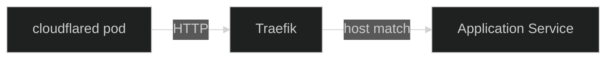
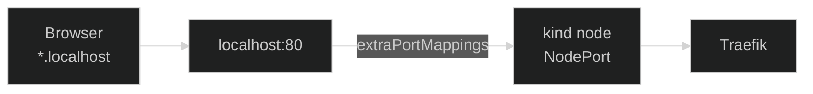

[Traefik](https://doc.traefik.io/traefik/){ target="\_blank" rel="noopener" }
is the **in-cluster ingress controller** in Nexus. It receives plain HTTP
from the [`cloudflared`](https://github.com/cloudflare/cloudflared){ target="\_blank" rel="noopener" }
tunnel pod, matches the request against the
[`Ingress`](https://kubernetes.io/docs/concepts/services-networking/ingress/){ target="\_blank" rel="noopener" }
resources in the cluster, and forwards it to the right `Service`.

## Why Traefik

A few things made Traefik the path of least resistance here:

- **Native `Ingress` provider.** Traefik watches the standard
  Kubernetes `Ingress` API directly — no custom resource is required to
  expose an app. Apps stay portable: their charts only know about stock
  Kubernetes objects.
- **Sane defaults.** The Helm chart ships with reasonable production
  defaults (deployment, service, RBAC, metrics) so the configuration in
  this repo is small and focused on the few things that actually need
  customising.
- **Built-in dashboard.** A live view of routers, services, and
  middlewares is one container flag away — useful when an `Ingress` is
  not behaving and you want to see what Traefik actually computed from
  it.
- **Low ceremony.** No per-service annotations to learn, no controller
  zoo to coordinate. Traefik is simple enough to disappear into the
  background once it is wired up.

## Where Traefik fits

TLS terminates at the Cloudflare edge, so by the time a request reaches
Traefik it is already plain HTTP. The hop chain inside the cluster is
short:



Everything upstream of `cloudflared` — the Cloudflare edge, the outbound
tunnel, why there is no public load balancer — is covered in the
[Networking](../networking/01-overview.md) section. From Traefik's point
of view it is just another HTTP client on the cluster network.

## Configuration choices

The chart in
[`platform/core/traefik/`](https://github.com/kbntx-org/nexus/tree/main/platform/core/traefik){ target="\_blank" rel="noopener" }
wraps the upstream
[Traefik Helm chart](https://github.com/traefik/traefik-helm-chart){ target="\_blank" rel="noopener" }
with a small set of opinionated overrides in
[`values.yaml`](https://github.com/kbntx-org/nexus/blob/main/platform/core/traefik/values.yaml){ target="\_blank" rel="noopener" }.
The decisions worth calling out:

- **Default `IngressClass`.** The chart registers a `traefik`
  `IngressClass` and marks it as the cluster default. App charts can
  set `ingressClassName: traefik` explicitly (the portfolio chart
  does), but anything that omits the field still ends up on Traefik —
  there is only one ingress controller in this cluster, and the
  default class makes that the obvious choice.
- **Stock `Ingress`, no CRDs.** The `kubernetesIngress` provider is
  enabled and the `kubernetesCRD` provider is **off**. Apps express
  their routing in the standard Kubernetes `Ingress` API; they never
  reach for `IngressRoute` or any of the other Traefik CRDs. The
  trade-off is deliberate: standard `Ingress` covers every routing
  need so far, and keeping CRDs out means app manifests stay portable
  and review-friendly.
- **Tolerant URL handling on the `web` entrypoint.** A handful of
  encoded-character allowances are turned on (encoded slashes,
  semicolons, percent signs, and so on). Some of the apps behind
  Traefik legitimately produce URLs that contain encoded characters
  in path segments, and the upstream defaults reject them as
  malformed. Loosening the entrypoint here, rather than asking every
  affected app to work around it, is the simpler call.
- **JSON access logs with a trimmed header allow-list.** Access logs
  are emitted as JSON so they can be parsed by whatever log pipeline
  consumes them. Header capture defaults to `drop`; only
  `CF-IPCountry`, `X-Forwarded-For`, `Referer`, and `User-Agent` are
  kept. That is enough to debug routing and trace traffic origin
  without persisting cookies, auth headers, or anything else
  sensitive that happens to ride along on a request.
- **Multiple replicas.** The deployment runs more than one replica so
  there is always a Traefik pod ready when `cloudflared` forwards a
  request. The `cloudflared` side of the tunnel is also replicated
  (see [Networking](../networking/01-overview.md)); pairing both ends
  keeps the public path tolerant of pod churn on either side.

The `websecure` entrypoint is **not** exposed: TLS is Cloudflare's job,
and there is no other source of HTTPS traffic inside the cluster.

## Exposing a service

Apps use a standard Kubernetes `Ingress`. The portfolio chart's
[`template.yaml`](https://github.com/kbntx-org/nexus/blob/main/apps/portfolio/chart/templates/template.yaml){ target="\_blank" rel="noopener" }
is a representative example:

```yaml
apiVersion: networking.k8s.io/v1
kind: Ingress
metadata:
  name: portfolio-ingress
spec:
  ingressClassName: traefik
  rules:
    - host: my-app.example.com
      http:
        paths:
          - path: /
            pathType: Prefix
            backend:
              service:
                name: portfolio-service
                port:
                  number: 80
```

Two things to keep in mind:

- The manifest is plain Kubernetes — no Traefik-specific annotations,
  no custom resources. If Traefik were ever swapped for another
  ingress controller, this resource would not need to change.
- An `Ingress` only handles in-cluster routing. To make the hostname
  publicly reachable, it also has to be wired up in the Cloudflare
  Tunnel ingress config so Cloudflare knows to forward it. That side
  lives in [Networking](../networking/01-overview.md).

## Dashboard

The Traefik dashboard is exposed via a small
[`Service` + `Ingress` template](https://github.com/kbntx-org/nexus/blob/main/platform/core/traefik/templates/dashboard.yaml){ target="\_blank" rel="noopener" }
that targets the Traefik API port. The chart also passes
`--api.insecure=true` so the dashboard does not require its own auth
layer.

That flag would be alarming on a publicly exposed installation, but the
dashboard hostname is **not public**: it is reachable only behind
Cloudflare Zero Trust + WARP (see [Networking](../networking/01-overview.md)).
Authentication and authorisation happen at the edge, before any request
ever crosses the tunnel into the cluster — the in-cluster service simply
trusts that anything reaching it has already been vetted.

## Local development parity

The same chart is reused for the [Tilt](https://tilt.dev/){ target="\_blank" rel="noopener" }-driven
local [`kind`](https://kind.sigs.k8s.io/){ target="\_blank" rel="noopener" }
cluster, with two overrides in
[`values.local.yaml`](https://github.com/kbntx-org/nexus/blob/main/platform/core/traefik/values.local.yaml){ target="\_blank" rel="noopener" }:
the Traefik `Service` is switched to `NodePort`, and the `web`
entrypoint is pinned to a known NodePort. The cluster bootstrap script
[`tools/bash/cluster.sh`](https://github.com/kbntx-org/nexus/blob/main/tools/bash/cluster.sh){ target="\_blank" rel="noopener" }
maps that NodePort to `localhost:80` on the host via `kind`'s
`extraPortMappings`.



The pay-off is that `*.localhost` URLs hit the local Traefik directly,
go through the same `Ingress` resources the production cluster uses,
and exercise the same routing rules — without `kubectl port-forward`
gymnastics. The full public-traffic path can be validated end-to-end
before anything ships.

What is missing locally is the Cloudflare side of the path: in
production, requests reach Traefik via the `cloudflared` tunnel; locally
they arrive directly from the host. Adding a local `cloudflared` stack
on top of this for full parity is a future option, but worth the cost
only if a bug is ever traced specifically to that hop.

## References

- [`platform/core/traefik/`](https://github.com/kbntx-org/nexus/tree/main/platform/core/traefik){ target="\_blank" rel="noopener" } — Traefik Helm chart wrapper
- [`platform/core/traefik/values.yaml`](https://github.com/kbntx-org/nexus/blob/main/platform/core/traefik/values.yaml){ target="\_blank" rel="noopener" } — production overrides (ingress class, providers, entrypoint, logs, replicas)
- [`platform/core/traefik/values.local.yaml`](https://github.com/kbntx-org/nexus/blob/main/platform/core/traefik/values.local.yaml){ target="\_blank" rel="noopener" } — local-cluster overrides (NodePort + dashboard host)
- [`platform/core/traefik/templates/dashboard.yaml`](https://github.com/kbntx-org/nexus/blob/main/platform/core/traefik/templates/dashboard.yaml){ target="\_blank" rel="noopener" } — `Service` + `Ingress` exposing the Traefik dashboard
- [`apps/portfolio/chart/templates/template.yaml`](https://github.com/kbntx-org/nexus/blob/main/apps/portfolio/chart/templates/template.yaml){ target="\_blank" rel="noopener" } — example app `Ingress` consuming the `traefik` class
- [`tools/bash/cluster.sh`](https://github.com/kbntx-org/nexus/blob/main/tools/bash/cluster.sh){ target="\_blank" rel="noopener" } — local `kind` cluster bootstrap with NodePort-to-host mapping
