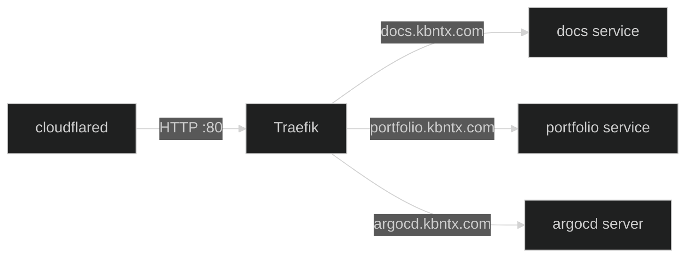

## What is Traefik?

Traefik is the **in-cluster ingress controller**. It receives traffic forwarded by the `cloudflared` tunnel daemon and routes it to the correct Kubernetes service based on the hostname in the `Ingress` resource.

TLS is terminated at the Cloudflare edge — traffic inside the cluster travels over plain HTTP.

## Traffic Path



## Exposing a New Service

Create a standard Kubernetes `Ingress` in the service's namespace:

```yaml
apiVersion: networking.k8s.io/v1
kind: Ingress
metadata:
  name: my-app
  namespace: my-app
spec:
  rules:
    - host: my-app.kbntx.com
      http:
        paths:
          - path: /
            pathType: Prefix
            backend:
              service:
                name: my-app
                port:
                  number: 80
```

Once applied, the [Cloudflare Ingress Controller](../networking/01-overview.md) automatically registers the hostname in the Cloudflare Tunnel config. No manual Cloudflare dashboard steps needed.

## References

- [`platform/traefik/`](https://github.com/kbntx-org/nexus/tree/main/platform/traefik) — Traefik Helm chart configuration
- [Traefik documentation](https://doc.traefik.io/traefik/)
